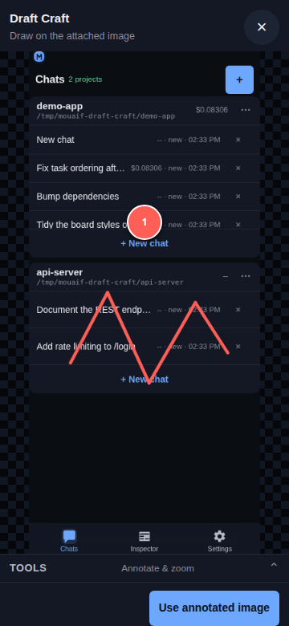
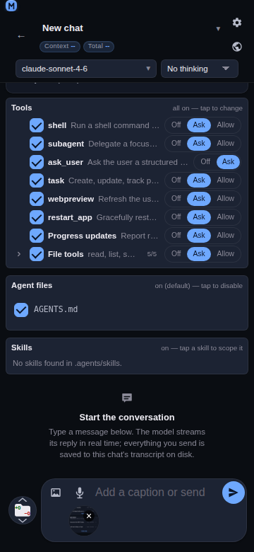
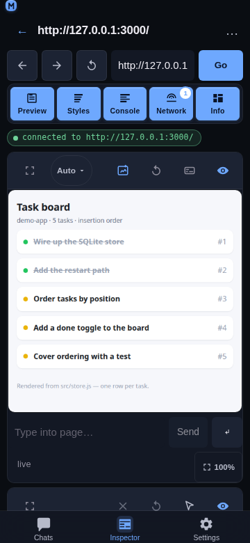
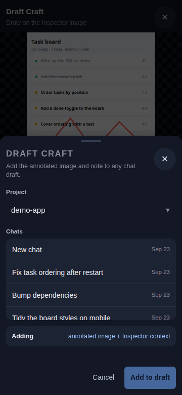
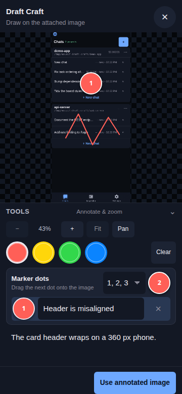
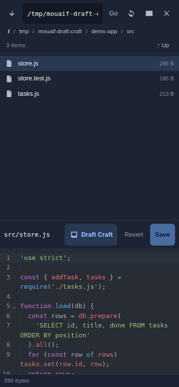

# Draft Craft

## Overview

Draft Craft adds material to a chat draft without sending it: an annotated image, code selected in the file editor, or an Inspector log / network entry. You always review the draft and press send yourself.



## Pick your starting point

Every path ends the same way: the material lands in a chat draft, and nothing is sent until you send it.

- **An image already in the composer, marked up** — start from the image chip. Go to [Path A](#path-a-mark-up-an-attached-image).
- **A marked-up screenshot of a web page** — start from **Inspector** → **Preview**. Go to [Path B](#path-b-mark-up-an-inspector-page).
- **Lines of code from a project file** — start from the chat file toolbar → **Files**. Go to [Path C](#path-c-add-selected-file-code).
- **A console log, exception, or network request** — start from the **Inspector** detail sheet. Go to [Path D](#path-d-add-an-inspector-entry).

## Path A: mark up an attached image

Use this when the image is already in the chat you want to send it from.



1. **Attach the image.** In the composer, tap the **add image** button, paste an image, or drag one in. It shows as a chip above the text field.
2. **Open the annotator.** Tap the image chip. The annotator opens with the title *Draw on the attached image*.
3. **Mark up the image.** Follow [Mark up the image, step by step](#mark-up-the-image-step-by-step).
4. **Finish.** Tap **Use annotated image**. The marked-up version replaces the attachment, and the annotation text is added to the draft.
5. **Review and send.** Edit the draft text if you like, then send as usual.

To undo, tap the chip again and tap **Reset**: the original image comes back and its annotation text is removed from the draft. Annotating the same image again replaces its previous annotation text instead of adding a second copy.

## Path B: mark up an Inspector page

Use this to send a screenshot of the page you are debugging to any chat.



1. **Connect.** Open the **Inspector** tab and connect to a browser tab.
2. **Open the annotator.** In the **Preview** panel's toolbar, tap the blue **Draft Craft** icon — the only blue button in the row, between the size picker and **Refresh preview**. The current page screenshot opens in the annotator.
3. **Mark up the image.** Follow [Mark up the image, step by step](#mark-up-the-image-step-by-step).
4. **Finish.** Tap **Add to chat draft**.
5. **Choose where it goes.** Pick a **Project**, then a chat, and tap **Add to draft**. The sheet confirms with *Added with Draft Craft.*
6. **Review and send.** Open that chat: the image is attached and the text is in the draft, ready to send.



The text added with an Inspector image starts with the page title and URL, so the model knows which page it shows.

## Mark up the image, step by step

Paths A and B share the same annotator. Do the steps you need, in this order; every step is optional.



1. **Open the tools.** Tap **Tools** (*Annotate & zoom*) under the image to show the controls. Tap it again later to hide them and give the image the full screen.
2. **Frame the area.** Tap **+** to zoom in, **−** to zoom out, or pinch with two fingers — the point between your fingers stays in place. Tap **Pan** and drag to move around a zoomed image, then tap **Draw** to go back to drawing. **Fit** shows the whole image again.
3. **Pick a color.** Tap one of the four color swatches. Both pen strokes and new dots use it.
4. **Draw.** Drag a finger on the image to circle or underline what matters.
5. **Place marker dots.** Under **Marker dots**, drag the colored dot button onto the image. Each dot gets the next label; choose **1, 2, 3** or **A, B, C** in the menu beside it. Drag a placed dot to move it. Up to 26 dots per image.
6. **Describe each dot.** Every dot has a row in the list below: type what that dot points at in its **Text for …** field. Tap a row's label to select that dot, or **×** to delete it.
7. **Add a note (optional).** Type a general comment in **Optional note about this image**.
8. **Finish.** Tap **Use annotated image** (Path A) or **Add to chat draft** (Path B).

Made a mess? **Clear** removes all strokes and dots and starts again from the clean image.

### What ends up in the draft

- The image, with your strokes and labeled dots drawn in.
- A short text block: the source (*Attached image* or *Inspector image*), the page title and URL for Inspector images, your note, then an **Annotations:** list with one line per dot.

```text
Inspector image
Checkout – Shop
https://example.com/checkout
The pay button is hidden on small phones
Annotations:
1. Button is cut off here
2. This banner overlaps it
```

## Path C: add selected file code

Use this to point the model at exact lines of a file.



1. **Open the file.** In a chat, open the file toolbar, choose **Files**, and open a text file.
2. **Select the code.** Select the lines you want in the editor.
3. **Tap Draft Craft.** It sits in the open file's display bar, beside the file actions.
4. **Choose where it goes.** Pick a project and a chat, then tap **Add to draft**.
5. **Review and send.** Open the chat and add your question around the code.

Only the file path with its line range and the selected code are added — no extra prose and no code fence.

## Path D: add an Inspector entry

1. **Open the entry.** In the **Inspector**, tap a row in the **Console** or **Network** panel — a log, an exception, or a request. Its detail sheet opens.
2. **Tap Add to chat** in the sheet's header, next to **Close**.
3. **Choose where it goes.** Pick a project and a chat, then tap **Add to draft**.
4. **Review and send.** Open the chat and send when ready.

See [Add Inspector entries to a chat](inspector-add-to-chat.md) for the exact text it adds.

## Good to know

- **Nothing is sent automatically.** Draft Craft never starts a model run.
- **Your draft is kept.** Existing text and attachments stay; Draft Craft only adds.
- **Eight images per draft.** The limit counts Draft Craft images and the ones you attached yourself.
- **Large images are shrunk.** An exported image that is too large is downscaled. If an image cannot be exported at all, the annotator stays open with an error, so nothing is added without it.
