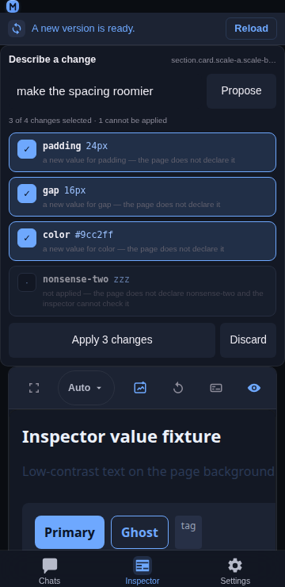

# Inspector intent

## Overview

Every other surface in the Inspector changes a value the user has already found: a property row, a rail, a swatch. **Intent** is the other entry point — describe the change in words ("make the spacing roomier"), get a **cited diff** back, and apply the lines you tick. It reuses the app's existing model client, and it derives every line it shows from the page: the element, its own declarations, the values this page uses, and its design tokens.

The model's answer is a *suggestion*, so the whole feature is built around making it checkable before anything is written.



## Usage

> **Not shown in the UI.** The surface is built, tested, and mounted behind a
> switch in `Inspector.jsx` (`const INTENT_SURFACE = false`) — flip it to `true`
> to get the **Intent** chip in the panel bar back. The rest of this page
> describes the surface as it behaves when that switch is on.

Open the **Intent** chip in the panel bar (it is toggled like a panel and its state is remembered). Select an element first — the description is about the element you picked.

1. **Type the change.** One sentence: `make the spacing roomier`, `tighten the type`, `tone the colours down`. The three examples under the field are buttons, so the interaction is legible without a manual.
2. **Propose.** The field is sent with the evidence the panel already read, and the answer comes back as a diff:
3. **Review the diff.** Every line is one proposed declaration, with its before → after, the evidence it was derived from, and its own tick:

```text
✓ padding        10px → 16px
  the page already uses 16px for padding in 9 places
✓ border-radius   8px → 12px
  the token --r-md is 12px — used by 14 other elements
✓ gap             8px → 12px
  a new value for gap — the page uses 8, 12
· font-weight           600
  not applied — the element already has this value
```

4. **Apply.** The primary button states the count (`Apply 3 changes`), so the list and the button can be checked against each other. Only ticked, applicable lines are written.
5. **Undo.** Each applied line is one receipt entry, so the whole intent unwinds to the state it started in — the same **Undo all** as a hand-made edit.

## Behaviour

- **A proposal is never applied unseen.** Each line shows its own before → after and a tick; the button says how many changes it will make. The model's output is a suggestion, and the UI is built so that is obvious rather than implied.
- **Everything the model is told comes from a read the panel already made.** The prompt carries the element, its declared declarations, the values the page uses for those properties, and the design tokens that resolve to them. No new page scrape, and nothing about the page that the inspector has not already read.
- **A missing input is stated, not invented.** With no page index the prompt says `(no page values read yet)`; an element with no inline declarations says `(none — it inherits or uses defaults)`. The model is never given a value nobody read.
- **The answer is parsed tolerantly and filtered strictly.** A fenced JSON block or a sentence around the object is accepted; a proposal without a plausible property name, with an empty value, or with an absurdly long one is dropped, because a blank line in a review list is worse than a shorter list.
- **Every line is checked against the page before it is shown.** A value the page already uses is cited with its count; a value that matches a token is cited by the token's name; a value neither the page nor a token uses is honestly called `a new value for padding — the page uses 4, 8, 12`.
- **A line that cannot be applied is marked, not hidden.** Three cases block a proposal and say why: a value the inspector cannot read (`not a value the inspector can read for padding`), a property the page does not declare *and* that the inspector cannot type (`the page does not declare … and the inspector cannot check it`), and a no-op against what the element already has (`the element already has this value`). A blocked line starts unticked and is not tappable — a tick that does nothing is worse than a line that explains itself.
- **"Off the page's scale" is not an error.** A value the page does not use is selectable and labelled `a new value`; the user is the one who decides whether the model is right.
- **A property proposed twice becomes one write**, keeping the value the user saw last, so the diff cannot leave a property holding a value that scrolled past.
- **The write path is the same one every other edit uses.** One `style.setProperty` per line against the retained element, and one receipt entry per property, so an intent is exactly as reversible as a hand-made edit — including restoring "was not declared" as a removal rather than an empty value.
- **The surface is not a sixth panel.** `PANELS` stays the five inspection views (Preview, Styles, Console, Network, Info) that the feature inventory pins; Intent is a different kind of thing — a request box and a diff, not a view of the connected page — so it has its own toggle and its own storage key. Its chip is not shown (see Usage): the panel bar renders `PANELS` only.
- **A new selection invalidates the diff.** Its lines name properties of the element that was selected, so applying them to another element would write to the wrong node; the list is cleared and the field is left for a new request.
- **With no model configured it says so.** The request fails with `No model configured. Add one in Settings → Models, then try again.` rather than a spinner that never resolves. The model used is whichever the project has configured for chat — the most recent pick from the server-backed recent list first, then the project's first model — and it is sent as the `{ modelId, providerId }` pair, so a model id that exists under more than one provider resolves against the connection it was picked from. The Inspector and the chat therefore agree on the default without a second setting.
- **A raw answer is shown when it parses to nothing.** If the model replies with prose, the text is displayed under a short error instead of vanishing, so a bad answer can be read and reported.

## Related

- [Inspector value suggestions](./inspector-value-suggestions.md) — the values and tokens this page already uses, which is the evidence the prompt is built from.
- [Inspector value rail](./inspector-value-rail.md) — the numeric changer, and the fan-out's write-back rules an applied line follows.
- [Inspector non-destructive editing](./inspector-non-destructive-editing.md) — what an edit changes, what it keeps, and how to undo it.
