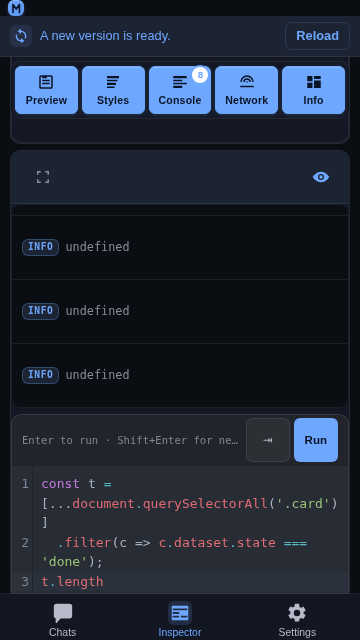

# Inspector JavaScript console

## Overview

The **Console** panel of the Inspector ends with a small JavaScript
console: a CodeMirror editor whose contents are evaluated in the inspected
page over the same CDP connection the log rows arrive on. It is the only
Inspector surface that is *typed into*, and it is designed for a phone first —
a soft keyboard, one hand, and a card that shares the screen with the log
above it.



## Usage

1. Open the **Inspector** tab, connect to a target, and switch on the
   **Console** panel.
2. Type an expression in the editor below the log.
3. Press **Enter** — or tap **Run** — to evaluate it in the page. The result
   is appended to the console log as a new row, sharing the log's stream, and
   the editor is emptied so the next entry starts clean.

```js
document.querySelectorAll('.card').length
```

Hardware keys and touch are equivalent:

| Action | Hardware | Touch |
| --- | --- | --- |
| Evaluate | `Enter` | **Run** |
| New line | `Shift` + `Enter` | `Enter` |
| Indent | `Tab` | **⇥** |
| Autocomplete | `Ctrl` + `Space` | type, or `Ctrl` + `Space` |
| Recall the previous entry | `↑` / `↓` | — |

The editor is **one line tall when it is empty** and grows with what has been
typed, up to about a third of the viewport; beyond that it scrolls. Run is
disabled while the box holds nothing but whitespace, so the button always
reflects whether it has anything to send.

### Autocomplete

Suggestions come from three layers, merged into one picker:

- a curated list of browser globals and console command-line helpers
  (`$0`, `$$`, `copy`, `inspect`, …);
- a live snapshot of the page's own globals, fetched once per editor and
  property-completed on demand (`Runtime.getProperties`);
- element references — every `id` on the page, so `#foo` targets appear by
  name.

Inside a property position (`document.`) the picker asks the page for that
object's own property names, which costs one CDP round-trip per completion
rather than one per keystroke.

## Behavior

- **The evaluation runs in the page**, not in the app: `Runtime.evaluate` with
  `includeCommandLineAPI: true`, so `$0`, `$$`, `copy` and `inspect` behave as
  they do in the desktop console.
- **Results land in the log.** An evaluated expression is appended as a
  console row, so it scrolls, expands, and can be sent to a chat draft exactly
  like a `console.log` from the page.
- **A whitespace-only entry is not sent**, and the button that would send it
  stays disabled.
- **The card is content-sized.** An empty console is one line of editor under
  the strip; a five-line expression is five. Nothing is reserved for a
  keyboard the user has not opened.
- **The cap lives on the scroll container.** When the expression grows past a
  third of the viewport the editor itself scrolls, so the caret line stays
  reachable and the log above keeps its share of the card.
- **The strip never loses an action.** The keyboard hint ellipsizes on a narrow
  phone while the two buttons keep their 44 × 44 px targets; nothing is pushed
  off the card.

## Implementation notes

- The component is [`frontend/src/components/inspector/JsConsole.jsx`](../../frontend/src/components/inspector/JsConsole.jsx)
  and it is mounted by `ConsolePanel.jsx` under the log's virtual list. The
  panel passes `onEvaluate` (which pushes the result row) and `getEval` (a
  `Runtime.evaluate` sender) down to it.
- **The editor is created once**, in a mount effect, and never rebuilt: the
  CodeMirror view, its completion source, and its history live for the life of
  the panel. The strip's two buttons are rendered by Preact on every render, so
  they reach the current view through refs (`runRef`, `indentRef`) rather than
  capturing a view from the first render.
- **The card's height is the document's.** An `EditorView.updateListener`
  reduces the document to one boolean — "is there anything in it" — and only
  re-renders when that boolean changes, so keystrokes inside a non-empty entry
  do not re-render the panel. It is deliberately driven by the document rather
  than by a keystroke, so paste, cut, undo and the Run path's clear all land in
  the same state.
- **The height cap has to be on `.cm-scroller`.** CodeMirror styles that
  element with a definite `height: 100%`, so a `max-height` on the wrapper is
  simply overflowed and clipped — which is what the old fixed 108 px box did,
  hiding a long expression with no way to scroll to it. Constraining the
  scroller keeps CodeMirror's own geometry intact and makes it the element
  that scrolls. `.cm-editor` is `height: auto` for the same reason: a percentage
  height would re-introduce the dead space the wrapper just stopped reserving.
- **The Tab button copies the current line's leading whitespace** and prepends a
  newline, which is what a keyboard `Tab` inside an indented block does — a soft
  keyboard has no `Tab` key at all, and `Ctrl` + `Space` is not reachable on a
  phone either, so this button is the only way to indent on touch.
- **In full screen** (`inspector-fullscreen.css`) the console wrapper stops
  filling the surface (`flex: 0 1 auto`) and the editor strip is pushed to the
  end of the card with `margin-top: auto`. The card is the panel's last child on
  a fixed, full-height surface, so a filling wrapper left the editor at the very
  bottom edge, inside the home-indicator inset, with empty space stretched
  around it.
- **Tests:** `scripts/test-inspector-js-console-mobile.js` drives the component
  in a VM against a miniature CodeMirror — typing, tapping Run, tapping Tab —
  and asserts the CSS invariants the mobile sizing depends on (content height,
  the scroller cap, the 44 px floor, the full-screen order). Run it with
  `node scripts/test-inspector-js-console-mobile.js`; it is also part of
  `npm run test:inspector`.

## Related

- [Inspector](./inspector.md) — the tab, its panels, and the console log.
- [Inspector full screen](./inspector-fullscreen.md) — one panel over the whole viewport.
- [Add Inspector entries to a chat](./inspector-add-to-chat.md) — sending an evaluated row to a draft.
- [Content Security Policy](./content-security-policy.md) — why `style-src` keeps `'unsafe-inline'` for CodeMirror.
