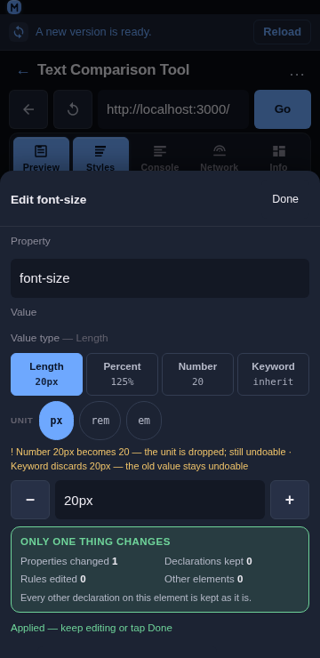
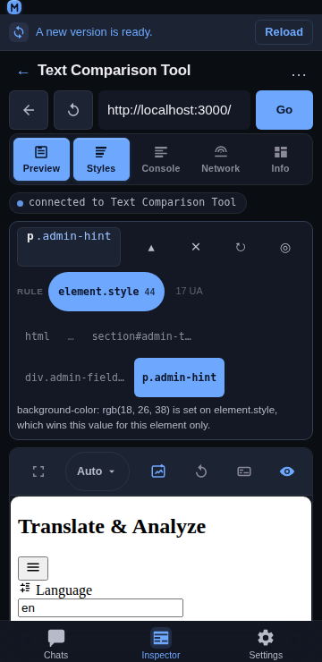

# Inspector non-destructive editing

## Overview

Every edit the Inspector makes lands on the selected element's own `element.style`, for **one property**. That is the safest target there is — it wins the cascade on that element and is fully reversible — but the panel used to say only “this row changed”, which answers neither *what else did that disturb?* nor *how do I get back?*. This feature makes both explicit: a **scope summary** before you commit, and a **receipt** afterwards with per-row and global undo.





## Usage

### Before committing: the scope summary

Open the edit sheet (tap a declared row or a quick-add chip). Above the actions, **Only one thing changes** reports what the upcoming write does:

| | |
|---|---|
| **Properties changed** | 1 — the one in the sheet |
| **Declarations kept** | every other declaration the element has |
| **Rules edited** | 0 — no stylesheet rule is touched |
| **Other elements** | 0 — the write addresses this element's own style object |

When the property is new to the element, the block says so: *“Adds font-size to this element — it had no declaration of its own before.”* That is the difference between overriding a value and introducing one, and it is worth knowing before you tap Apply.

### After committing: the receipt

Each applied change appears in a strip at the top of the Styles panel:

```
2 changes                                   ↺ Undo all
font-size           —  → 20px   ↺
background-color    —  → rgb(18, 26, 38)   ↺
```

- **Newest first**, because the thing you just did is the thing you are most likely to reverse.
- **The struck-through value is what the property had before this session touched it** — not before the last Apply. Editing one property three times gives one line, and one ↺ returns to the original.
- **A property that was not declared before shows a dash**, and undoing it *removes* the property rather than setting it to an empty value (the same to the browser, a different action to read back).
- **Every row has its own ↺**, and **Undo all** reverses the whole list newest-first in one pass.
- The strip renders nothing when there is nothing to undo, and it is cleared when the selection changes or is cleared — its entries name properties of the element that was selected, so undoing them against a new element would write to the wrong node.

### Combined with the value-type switch

A type switch (`16px` → `1rem`) is only a rewrite of the field until Apply, so it produces at most one receipt line for the property — and the receipt shows the value from before the switch, not the intermediate one.

## Behaviour

- **Only one property can change per write.** The write is `style.setProperty(prop, value)` for the property in the sheet: it cannot rewrite the element's style block, and it cannot touch another element, because it addresses the resolved element's own style object rather than a selector.
- **No stylesheet rule is edited.** Rule-level editing needs `CSS.setStyleTexts` plus stylesheet source parsing, which is not enabled; `Rules edited 0` is a statement of that, not a claim about intent. The rules are visible in the target bar and the Matched rules section.
- **Undo restores the value, it does not “un-apply”.** The plan is `set` with the remembered value, or `remove` when there was no previous declaration — so an element returns to the exact state it was in, including having no declaration at all.
- **An edit that ends where it started leaves no trace.** Typing `16px`, then `20px`, then back to `16px` removes the entry, leaving nothing to undo — and applying the value a property already holds is not recorded either. The list never offers to reverse a change that is not there.
- **The receipt is capped at 20 entries** (oldest dropped) so a long session cannot grow the strip without bound.
- **The receipt is owned above the panels, and lives with the selection.** The Styles panel records into it and renders its own strip from it, but the Inspector stores and reverses it: an entry is written by the panel (`onRecordChange`), the list is rendered by both the panel's strip and the bar's copy, and undo runs in the Inspector against the retained `objectId` (`undoEntryFromBar` / `undoAllFromBar`) so it works while the panel is switched off. After an undo the Inspector re-reads the element and corrects its retained snapshot, then bumps a nonce which the panel watches to re-read its own copy of the declarations.
- **A failed revert reports on the panel's status pill** and leaves the entry in place, so the change is not lost from the list just because the write failed.

## Implementation notes

- **Pure model:** [`frontend/src/components/inspector/scope.js`](../../frontend/src/components/inspector/scope.js) exports `scopeSummary`, `recordChange`, `undoPlan`, `undoOrder`, `summarizeReceipt`, `receiptRows`, `describeChange` and `MAX_RECEIPT`. Plain objects in, plain objects out — no DOM, no CDP — so the counting, the merge rule (keep the original `from`), the no-op collapse and the undo plan are all unit-testable.
- **Wiring:** the `Receipt` component lives in [`frontend/src/components/inspector/StylesPanel.jsx`](../../frontend/src/components/inspector/StylesPanel.jsx) and the bar's smaller copy in [`frontend/src/components/inspector/TargetBar.jsx`](../../frontend/src/components/inspector/TargetBar.jsx). The **list itself is owned by the Inspector** (`Inspector.jsx`: `receipt`, `recordReceipt`, `undoEntryFromBar`, `undoAllFromBar`), which is what lets the receipt — and its undo — outlive the Styles panel that made the writes. The previous value is read from the model **before** the write, because after it the value is gone.
- **No new endpoints:** undo uses the same `Runtime.callFunctionOn` helpers as an edit (`style.setProperty` / `style.removeProperty`), so an undo is a write like any other — which is also why it is recorded as one and re-reads the element afterwards.
- **Mobile-first:** every receipt row is a ≥44 px target with a 44 px ↺, the scope grid is two columns at 360 px, and neither surface scrolls horizontally.
- **Tests:** `npm run test:inspector` covers this with `scripts/test-inspector-scope.js` (62 assertions): the scope numbers including added-vs-overridden and case-insensitive matching, the receipt merge (re-editing keeps the original value), the no-op collapse, the cap, the undo plans (`set` vs `remove`), newest-first ordering without mutation, the row text for an added and a removed property, and the panel wiring (the previous value is read before the write, undo goes through the plan, the changed set is updated, and the receipt is cleared on a selection change and on Clear). `scripts/test-inspector-styles-order.js` additionally pins that a selection change clears both the change set and the receipt.

## Related

- [Inspector Styles panel](./inspector-styles.md) — tap-to-select, inline editing, matched rules, computed values.
- [Inspector target bar](./inspector-target-origin.md) — which element and which rule an edit lands on.
- [Inspector value types](./inspector-value-types.md) — switching a value between length, number, percentage and keyword.
