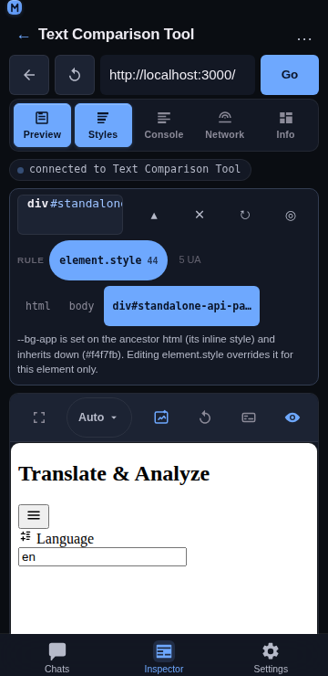

# Inspector target bar

## Overview

The **target bar** sits directly above the Inspector's panels and answers the three questions a CSS edit depends on: **which element** is selected, **which rule** a value comes from, and **where the edit lands**. The Styles panel implies all three; the bar states them, so a value that a class supplies is visible before the user wonders why changing it “does nothing”.

## Usage

Connect to a page and select an element (tap the preview in pick mode, tap **Tap element**, or type a selector in the Styles panel). The bar appears above the panels:

1. **Tag chip** — the element in DevTools notation (`div#standalone-api-panel.standalone-api-panel`) with its box size. The size is dropped when the box could not be measured, so a meaningless `— × —` is never printed.
2. **Rule chips** — the rules that match, best answer first: `element.style` (marked as the write target), then author rules on the element, then inherited rules. Each chip carries its declaration count. Browser-default (`UA`) rules are **counted, never chipped** — their “selector” for a `div` is the whole HTML element list, which would wrap the row to five lines on a phone; the Styles panel lists them behind its own **UA** toggle. Chips past the third are reported as `+N`, UA rules as `N UA`.
3. **Breadcrumb** — the path to the element (`html › body › div#standalone-api-panel`), current element highlighted. Tap any ancestor to select it: the same code path as the Styles panel's own breadcrumb, so the highlight, the pinned element preview and the changed-set reset all stay in sync. Labels are truncated to keep the row one line at 360 px; the full label is on the crumb's tooltip and accessible name. Deep paths elide the middle (`html › … › parent › here`) rather than dropping the root or the immediate parent.
4. **Origin sentence** — one line explaining where the focused value comes from and what editing will do, e.g.
   - `padding: 16px is set on element.style, which wins this value for this element only.`
   - `padding comes from the stylesheet rule .card (16px). Editing element.style overrides it for this element only.`
   - `gap comes from an inherited rule on form.compare. Editing element.style overrides it for this element only.`
   - `--bg-app is set on the ancestor html (its inline style) and inherits down (#f4f7fb). Editing element.style overrides it for this element only.`
5. **Header controls** — **✕ Clear**, **↻ Refresh** and **◎ Pick** are shortcuts into the Styles panel's own actions (not a second implementation), plus **▴ / ▾** to collapse the bar.
6. **Collapse** — the expanded bar is ~216 px at 360 px wide (four rows), which matters on a 667 px screen. Collapsed it keeps the identity row and the rule chips (where an edit lands) and hides the path and the origin sentence, for ~106 px. The choice persists in `localStorage` under `mouaif:inspector:targetbar:collapsed`, like the panel visibility.

## Behaviour

- **Which property is described** follows the user's attention: the property being edited, else the most recent change this session, else the element's first own declaration, else the first declaration of the best-ranked author rule. That last fallback matters: an element with no inline styles is the common case, and without it the bar would have nothing to explain exactly when the question is “where do this element's values come from?”. Browser-default declarations are never chosen.
- **The write target is inline only, and the bar says so.** `element.style` wins the cascade on the element and is fully reversible, so every edit from this panel goes there. Editing a stylesheet rule needs `CSS.setStyleTexts` plus stylesheet source parsing; `WRITE_TARGETS` in `targetBar.js` lists that target as *not enabled yet* rather than leaving its absence unexplained.
- **The selection stays owned by the Styles panel.** The bar reads a snapshot the panel publishes (`onSelectionChange`) after each selection or cascade read, and it asks the panel to act through one handle ref (`panelHandlesRef`: `selectAncestor`, `clear`, `refresh`). That is what keeps tap-to-select, the element tree and the pinned preview untouched by this feature — and why the bar disappears when the Styles panel is hidden, since the selection lives with it. Hoisting the selection above the panels (so the bar survives a mode switch) is a later change.
- **Tapping a rule chip reveals the cascade** rather than pretending the chip is an editor: the Styles panel's **Matched rules** section is where a rule's declarations and the one-tap override live, so the chip makes sure that panel is visible.
- **No horizontal scrolling.** Both the breadcrumb and the rule row wrap (a horizontal scroller inside a vertical page steals the vertical gesture), and nothing in the bar scrolls — the panels below keep the only scroller.

## Implementation notes

- **Pure model:** [`frontend/src/components/inspector/targetBar.js`](../../frontend/src/components/inspector/targetBar.js) exports `buildTargetBar`, plus `splitLabel`, `buildCrumbs`, `crumbLabel`, `cleanSize`, `buildRuleChips`, `ruleCount`, `findDeclaringRule`, `inlineValueOf`, `pickFocusProperty`, `firstAuthorProperty`, `originSentence`, `WRITE_TARGETS` and the caps (`MAX_CRUMBS`, `MAX_RULE_CHIPS`, `CRUMB_MAX`). Nothing there touches the network or the DOM, so the ranking, the caps, the fallback order and the sentence wording are unit-testable.
- **Component:** [`frontend/src/components/inspector/TargetBar.jsx`](../../frontend/src/components/inspector/TargetBar.jsx) is layout only — `Crumbs`, `RuleChips` and `TargetBar` render the model, and the header buttons are optional (a control with no handler is not rendered, rather than rendered dead).
- **Reused data, no new endpoints:** the label/size come from the existing `buildNodeModel`, the rules from `normalizeMatchedRules` (already used by the Styles panel's Matched rules section), the path from `readElementTree`, and the inline declarations from `readElementStyles`. The bar adds no CDP call of its own.
- **Mobile-first:** every interactive element is a ≥44 px target (`--tap`), the chips and the collapse label are text (not icon-only), and the strip is a fixed column of rows so the panels below keep their own height budget.
- **Tests:** `npm run test:inspector` covers this bar with `scripts/test-inspector-target-bar.js` (114 assertions): the tag/id/class split, the crumb order and elision and truncation, the chip ranking (inline > on-element > inherited) and that browser defaults are counted rather than chipped, the declaration counts, the four origin-sentence cases, the focus-property fallback order, the scope numbers, the component rendering (only in selection, crumbs tappable, counters, collapse hiding path+origin while keeping the chips), and the wiring (the panel publishes, the parent builds the model, the collapse choice persists). `scripts/test-inspector-feature-inventory.js` also pins that the bar exists and that the Styles panel still publishes its selection.

## Related

- [Inspector](./inspector.md) — the host tab and its other panels.
- [Inspector Styles panel](./inspector-styles.md) — tap-to-select, inline editing, the element tree, matched rules and computed values.
