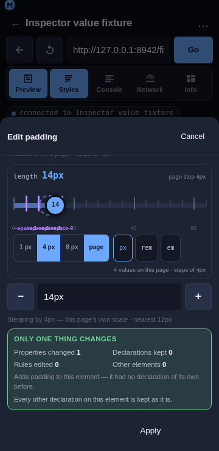
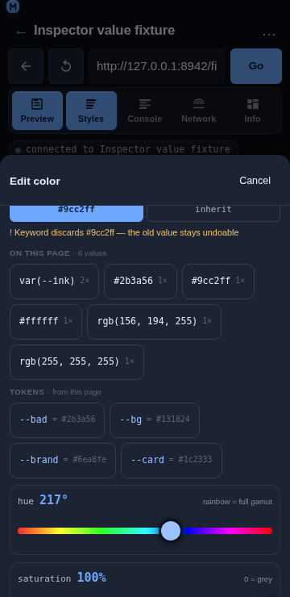
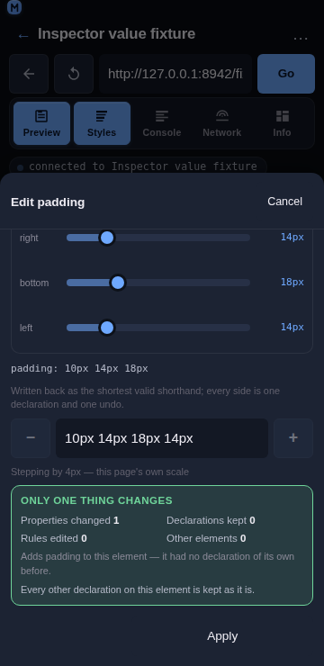

# Inspector value rail

## Overview

The edit sheet's value field is the source of truth: it is where a value comes from, where a suggestion lands, and what **Apply** commits. What it is bad at is *choosing* a number on a phone — the range is invisible, the page's own steps are invisible, and trying `14px` instead of `16px` costs four taps on a keyboard. The **value rail** is therefore one numeric changer for every numeric kind: a track whose ticks are the values this page already uses, a thumb you drag, a precision segment, a unit chip, and the before → after readout in its header.



## Usage

Open the edit sheet for a numeric property (tap a declared row, or a quick-add chip such as **padding**). The rail sits directly above the value field, under the page's own values and tokens.

1. **Drag the thumb.** The value field updates live; nothing is written to the page. Release, then **Apply** to commit — exactly like the type switch and the suggestion chips.
2. **Tap a tick.** The labelled round numbers (`0 20 40 60`) are buttons: one tap lands the value on that number. A violet tick is a design token, and tapping it writes the token's *value* (`--space-3 = 12px` → `12px`).
3. **Pick a step.** The precision segment offers `1 px`, `4 px`, `8 px` and `page`. `page` uses the step the value index derived for this property from the page's own values (`steps of 4px`), which is the same step the `−` / `+` buttons in the value row use.
4. **Cycle the unit.** The unit chip rewrites the same value in another unit (`px` ⇄ `rem` ⇄ `em`, `ms` ⇄ `s`, `deg` ⇄ `turn` ⇄ `rad`), using the page's real root font size rather than an assumed 16 px. A unit whose base size the inspector has not read is shown ticked-out.
5. **Read the header.** It states the kind, the value the property had before this session's first edit on it (struck through), the value now, and the step in force: `length 16px 44px page step 4px`.
6. **No rail is stated, not hidden.** A value with no numeric range (a keyword, a colour, `calc()`, an unparsable expression) renders `No rail: this value is not a number, so there is nothing to drag.` — the typed field stays the only control, which is the honest fallback rather than a disabled slider.
7. **The value being typed is placed on the page's scale.** When the field holds a value that is *not* one of the page's own, the rail draws the nearest on-scale value as a dashed ghost ring, and the suggestion row above it names the same value with a one-tap snap.

## Every kind, and the view it gets

The rail is the right changer for *a* number. It is the wrong control for a colour (three numbers that only mean something together), for a four-sided shorthand (four numbers that are one declaration), for a function list (an ordered list of rail-shaped arguments) and for an enum (not a number at all). The edit sheet therefore picks a view per kind, in the ladder the mock states: a numeric kind gets the rail, a numeric shorthand fans out, a known keyword set gets segments, a list of functions gets one rail per argument, and anything else falls back to the typed field with the reason stated.

The view is chosen from the value the property holds when the sheet opens, and **held for as long as the sheet is open**: dragging one side with "link all sides" on turns `10px 14px 18px 14px` into `12px`, and the four rails must not collapse into a single slider under the user's finger.

| Kind | View | Properties |
| --- | --- | --- |
| Length, number, percent, `scale()`, custom property holding a number | The rail | `padding: 14px`, `opacity: 0.5`, `--space-card: 14px` |
| Colour | Three rails (hue / saturation / lightness), the page's palette with per-swatch contrast badges, hex / rgb / hsl format chips | `color`, `background-color`, `border-color`, `--brand` |
| Fan-out | One sub-rail per side plus a "link all sides" switch | `padding`, `margin`, `inset`, `border-width`, `border-radius`, `gap`, `background-position` |
| Enum | Segmented keyword chips, the page's own values first and the CSS-wide keywords last | `display`, `position`, `overflow`, `text-align`, `flex-direction`, `align-items` |
| Functions | One rail per argument, or one row per item for a comma list | `transform`, `filter`, `box-shadow`, `text-shadow`, `transition`, `animation` |
| Image | The page's own images and gradients as candidates — no rail | `background-image`, `mask-image`, `list-style-image` |
| Time / Angle | The rail plus its unit segment | `transition-duration`, `animation-delay`, `rotate`, `hue-rotate` |
| Anything else | The typed field, with a note saying why there is no view | `font-family`, `content`, `calc()`, `var()` |

### Colour



Three rails instead of one, because a colour is three numbers that only mean something together, and because each rail's track can then be a *picture* of the value: the hue track is the full gamut at the current saturation and lightness, the saturation track runs grey → colour, and the lightness track runs black → colour → white.

- **HSL is kept as HSL.** A typed `hsl(220, 38%, 15%)` becomes `rgb(24, 33, 53)`, whose own hue is 221.7° — so a rail built from the pixels would read 222° for a value the user typed as 220°, and dragging it one step would write a colour they did not ask for. The parse keeps the original H/S/L where the value has it.
- **The palette shows the ratio before Apply.** Each swatch carries its WCAG badge against the element's resolved background (`#2b3a56 fail 1.4:1`, `#9cc2ff AAA 8.7:1`), and a failing swatch takes the danger styling. Candidates are capped at five, because a swatch with a value and a badge is three times the width of a plain chip.
- **The format chips rewrite the *form*, not the colour.** `hex` / `rgb` / `hsl` pick how the rails write back, and the choice survives a drag — which is the difference between a colour view and a converter.
- **`currentcolor` is explained, not clamped.** It is a keyword whose value is another property's, so the view says so and leaves the typed field as the control.
- The palette is rendered **once**: while the colour view is up, the suggestion row above drops its own colour group rather than showing the same candidates twice.

### Time and angle

The rail is the changer; the unit segment is what the kind adds. Time cycles `ms ⇄ s` and angle cycles `deg ⇄ turn ⇄ rad`, each converting the *current* value so the write is the same duration or rotation in another unit (`180ms` ⇄ `0.18s`, `12deg` ⇄ `0.0333turn`). The angle rail's range is −180…180 and its snaps are the right angles the mock lists — 0° / 45° / 90° / 180°, plus their negatives.

### Enum


Segmented keyword chips, ranked: the values **this page uses** first (in the order the index reports them, so `flex` beats `grid` on a page that uses flex more), then the property's own spec set, then the CSS-wide keywords last. A value the page uses is marked, because it is the likelier choice.

The view only appears for a property with a real choice set — **two or more of its own keywords**. `keywordsFor` always appends `inherit` / `initial` / `unset` / `revert`, so a "more than one keyword" rule would make every keyword an enum and give `transform: none` a five-chip row of which four are the CSS-wide ones.

### Functions and comma lists

One rail per argument, each typed by its own kind, with the item's name as the row label:

```text
transform
  arg 1   translateY(−4px)
  arg 2   scale(1.02)
```

A property that is a list of *shorthands* rather than of function calls (`box-shadow`, `transition`) gets the same view with its items split on the top-level commas instead of on function names, so a shadow's four values are four rails and a two-item transition list is two rows. Splitting is bracket-depth aware, which is what keeps `rgba(0, 0, 0, 0.4)` and `calc(100% - 2px)` in one piece.

### Fan-out



A four-value shorthand becomes four sub-rails, with the value line under them showing what will be written:

```text
padding: 10px 14px 18px 14px
  top     [───●────]  10px
  right   [────●───]  14px
  bottom  [─────●──]  18px
  left    [────●───]  14px
  padding: 10px 14px 18px
```

- **The expansion is CSS's own rule**, not a guess: one value repeats four times, two values repeat as a pair, three repeat the second for the left, four are as written. `gap` and `background-position` take two values rather than four, and are fanned out as a pair.
- **"Link all sides" starts on for a shorthand that is already uniform.** That is the state the user is in; starting it off for `10px` would make the first drag surprising.
- **Write-back is the shortest valid form** for display (`10px 14px 18px 14px` → `10px 14px 18px`, four equal values → `10px`). The full shorthand round-trip guarantees, including the longhand fallback for values that cannot collapse, land with `shorthandFor` in R3 — until then a fan-out edit writes the collapsed shorthand, which is what the view shows.
- **A shorthand that cannot be taken apart is refused with its reason.** `padding: inherit` and `padding: calc(100% - 2px)` have no sides to drag, so the view says so and the typed field stays the control.

### Image and text

An image is not a number, so the image view offers the page's own `url()` and gradient values instead of a rail — the honest alternative to dragging nothing. Everything else (an unparsable value, a keyword with no choice set, a font stack) renders the typed field with a one-line note stating why there is no view. Nothing is ever a silently disabled control with no explanation.

## Behaviour

- **The rail never writes to the page.** It only rewrites the sheet's value field, so a drag is one property and one undo receipt entry, and the element's other declarations are untouched. Verified live: after a full drag the inspected element's `style` attribute is still empty, and it changes only after **Apply**.
- **The rail never touches another property.** The only write path is the same `style.setProperty` the rest of the sheet uses, addressed at the property the sheet was opened for.
- **Ranges are per property family, not global.** `opacity` is 0…1, `line-height` 0…3, `z-index` −10…100, an angle −180…180 (0…360 for a hue), a time 0…2000 ms, a `scale()` 0…3, a percentage 0…200, and a length 0…4× the element's own size.
- **A length is measured against the right size.** A box property (`width`, `top`, `max-height`) is scaled by the element's box; a spacing, radius or type property is scaled by the element's font size, because a `16px` padding measured against a 448 px card would sit at 0.9% of the rail — technically "4× the size" and impossible to drag.
- **A logarithmic scale is used only where it helps.** A range whose maximum is at least 100× its minimum (`1px … 1000px`) is mapped logarithmically, which is the only case where a linear thumb spends most of its travel on values nobody wants. A range that starts at 0 is always linear, because a rail that cannot reach its own minimum is worse than a coarse one.
- **The value in force is always on the rail.** If the property's current value sits outside the family's usual bounds (`z-index: 400`), the range grows to include it rather than parking the thumb at an end and reading a different number than the page holds.
- **Ticks are capped so they stay ticks.** A 0…2000 ms range at a 10 ms step would be 200 marks ~1.7 px apart on a phone: the step is widened to the next multiple that fits 40 ticks, keeping the ticks on multiples of the page's step. A range with no page step gets ten evenly spaced ticks, which is the most the rail can show without implying precision it does not have.
- **Tokens are dropped rather than approximated.** A token outside the range, in another unit, or holding something that is not a number is not ticked — a violet mark at the wrong place is worse than no mark.
- **A drag never churns the field.** Writing the value the field already holds is a no-op, so a tap on the track cannot wipe a half-typed value.
- **The gesture is one pointer capture, no drag library.** The track is 60 px tall with `touch-action: none`, so the sheet's vertical scroller cannot claim a horizontal drag and the moves keep arriving after the finger leaves the track. Arrow keys work too (Left/Right, Down/Up), which costs nothing and makes the control usable with a keyboard.
- **Every control is a ≥44 px target**: the thumb is 34 px of ink inside the 60 px track, the tick labels carry 44 px hit areas without widening their marks, and the segment and unit chips are 44 px tall.
- **Nothing scrolls sideways.** The rail is 336 px inside the 360 px sheet, its labels are absolutely positioned inside the track, and the sheet body and the page both measure `scrollWidth − clientWidth = 0`.

## Implementation notes

- **Pure model:** [`frontend/src/components/inspector/valueRail.js`](../../frontend/src/components/inspector/valueRail.js) exports `railRange`, `familyOf`, `valueToRatio`, `ratioToValue`, `quantize`, `snapStep`, `nudge`, `tickValues`, `majorValues`, `railTicks`, `railLabel`, `railWritable`, `isLogRange`, `fromUnit`, `LOG_RATIO`, `MAX_TICKS` and `MAX_MAJOR`. It consumes the scale shape the value index already produces (`{ unit, values, step, decimals }`), so the rail costs no extra page read.
- **Per-kind model:** [`frontend/src/components/inspector/valueShapes.js`](../../frontend/src/components/inspector/valueShapes.js) exports `valueShape` (the ladder), `sidesFor` / `splitSides` / `joinSides` (the fan-out), `functionList` / `joinFunctions` / `listItems` / `joinListItems` (function and comma lists), `enumValues` (the ranking), `parseColourParts` / `joinColourParts` / `colourRailValues` / `applyRailPart` (the colour view) and `timeOptions` / `angleOptions` / `imageCandidates` / `ANGLE_SNAPS`. It is the only place that knows how to take a value apart and put it together, so the components stay thin and every round trip is testable without a DOM.
- **Component:** [`frontend/src/components/inspector/ValueRail.jsx`](../../frontend/src/components/inspector/ValueRail.jsx) exports `ValueRail` (the track), and [`frontend/src/components/inspector/ValueKindsView.jsx`](../../frontend/src/components/inspector/ValueKindsView.jsx) exports `ValueKindsView` (the per-kind views, plus the compact `SubRail` the fan-out and function rows share). Both read a property, a value, a context and an `onChange`.
- **Wiring:** `StylesPanel.jsx` assembles the context once per render (`scaleFor` for the step, `tokensFor` for the violet ticks, the element's box or font size for a length range, `snapValue`'s nearest value for the ghost) and passes `onChange` that only calls `setValue` — the same contract as `ValueTypes` and `Suggestions`, so `Apply` remains the single commit point. It also decides which of the two changers is shown, from the shape held per sheet.
- **Mobile-first:** the track is 60 px tall with a 34 px thumb, `touch-action: none` keeps the vertical gesture with the sheet, the labels are absolutely positioned so a long token name cannot widen the rail, the end labels and end marks are shifted inside rather than centred so nothing hangs past the track, and the footer wraps.
- **Tests:** `npm run test:inspector` covers this with three suites. `scripts/test-inspector-value-rail.js` (134 assertions) covers the per-family ranges, monotonicity and exact endpoints for every range, the log mapping and its geometric-mean midpoint, clamping in both directions, step selection and precedence, the nudge pair, tick generation with the cap, major-label rounding, token ticks (in range, out of range, wrong unit, unparsable, duplicated), label round-trips, the `railWritable` fallback reasons, the unit bases, and the mock's own rail end to end. `scripts/test-inspector-value-shapes.js` (157 assertions) covers the shape ladder for 27 property/value pairs, the shorthand expansion and collapse round trip, the function and comma-list splitting with nested brackets, the enum ranking and de-duplication, the colour parsing and write-back in all three formats, the HSL round trip, the three rails, the time and angle conversions, the image candidates and the contrast hand-off. Gesture handling is verified live, not unit-tested.

## Related

- [Inspector value suggestions](./inspector-value-suggestions.md) — the page's own values, the snap hint and the contrast badges.
- [Inspector value types](./inspector-value-types.md) — switching a value between length, number, percentage and keyword.
- [Inspector non-destructive editing](./inspector-non-destructive-editing.md) — what an edit changes, what it keeps, and how to undo it.
