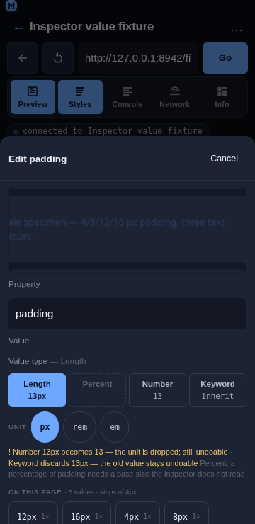
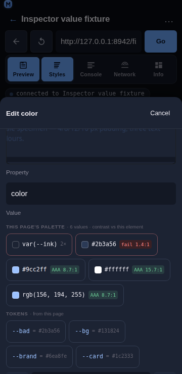

# Inspector value suggestions

## Overview

The type switch changes *how* a value is written and the unit cycle rewrites the same value in another unit — but neither answers the question that actually stalls an edit: **what should this value be?** The edit sheet therefore lists the values and design tokens **this page already uses** for the property being edited, each with the evidence behind it: how many times it appears and which rule supplies it. On top of that list it adds two pieces of guidance the evidence alone cannot give: the value being typed is placed **on the page's own numeric scale** (with the nearest value and its distance named), and every **colour** candidate carries its **WCAG contrast ratio** against the element it would be applied to.



## Usage

Open the edit sheet (tap a declared row or a quick-add chip). Below the value-type switch, for a property the page declares:

```text
Value type — Length        [ Length 16px ][ Percent 100% ][ Number 16 ][ Keyword inherit ]
On this page · 3 values · steps of 4px
  [ 16px 3× ]  [ 12px 1× ]  [ 8px 1× ]
Tokens · from this page
  [ --space-4 = 16px ]  [ --space-3 = 12px ]
Stepping by 4px — this page's own scale · nearest 16px
4 values on this page · steps of 4px
```

1. **On this page** — the values declared for this property anywhere in the page's stylesheets, most-used first. Each chip carries its count (`3×`) and, on its tooltip, the rule that supplies it (`used 3 times (.card)`) and its origin (`inherited from form.compare`). The header counts **every** value the page declares, not just the chips that fit: a property with thirty padding values reads `34 values seen` where the row shows six, because "this property has a scale" and "here are the six most-used values" are different claims.
2. **The value in force** — the one the element already resolves to is highlighted, not sorted away: picking it back is a legitimate way to undo a pending edit.
3. **Match a sibling** — what the element's *peers* use for this property, one chip per distinct value, labelled with the element it comes from:
```text
Match a sibling · what the peers use
[ 16px 2nd section.input-section ]  [ 8px 4th section.toolbar ]
```
The page's stylesheet values are anonymous; a peer is a referent the user can go and look at ("the 2nd section.input-section uses 16px"), which is where a spacing decision usually starts. The value already in the field is not offered back.
4. **Tokens** — custom properties (`--*`) whose value is valid for this property, shown as `--space-4 = 16px`. Picking one inserts the token **name**, so the declaration points at the design system rather than copying its value.
5. **The step** — when the page's values for the property share a numeric scale, the group header states it (`steps of 4px`) and the note under the chips repeats the evidence: `4 values on this page · steps of 4px`. The `−` / `+` steppers on the value field move by that step instead of by 1, and the line under them says so: `Stepping by 4px — this page's own scale`.
6. **The snap hint** — a value that is not one of the page's own values is marked with the value struck through, the nearest page value and how far off it is, and a **Snap to 16px** button:

   ```text
   13px  nearest 16px · 3px away    [ Snap to 16px ]
   ```

   An on-scale value says so quietly (`on scale · 4 px step`) and offers no button.
7. **Colour contrast** — for a colour property the chip row becomes the page's palette, each swatch carrying its ratio against the element's resolved background: `#9cc2ff AA 8.7:1`, `#2b3a56 fail 2.4:1`. A chip that fails takes the danger styling, so a legibility mistake is visible before Apply rather than after. When the page offers fewer than three colours for the element, a **Readable on this element** group adds the higher-contrast of white and black.
8. **Tapping a chip only rewrites the field.** Apply still commits, so a suggestion, a snap, a sibling value and a palette pick are exactly as reversible as anything typed — one property, one undo entry.



## Behaviour

- **The index is built from what the panel already reads** — the normalized matched rules and the computed style — so suggestions cost no extra CDP call. It is memoised because the panel re-renders on every CDP event (a console row, a network response) while those two inputs change only on a selection or an edit.
- **The count is evidence, not decoration.** `16px · 3×` says the design already uses this value three times, which is the difference between a guess and a choice. The rule name is on the tooltip because it is the answer to “where does that come from?”. The group header counts what the page declares (`valuesSeen`), so a capped chip row still reports the size of the set it was drawn from.
- **A sibling value is read, and read once.** `readSiblingValues(objectId, property)` walks the selected element's `parentElement.children` in one `Runtime.callFunctionOn` and returns `{ prop, value, label }` per peer, where the value is the peer's **computed** value (a sibling that inherits its padding is using that padding) and the label is the peer's ordinal and tag (`2nd section.input-section`). It runs once per property the sheet is open on — the reader is held in a ref, not in the effect's dependencies, so the panel's constant CDP re-renders cannot re-trigger it — and it is capped at 12 peers, because a 500-row table must not turn one tap into a thousand-element read. `siblingValues` groups those rows by value for the chips, so two peers on `16px` are one chip with `16px` and the first of their two labels.
- **The sibling row is a hint, not a rule.** It offers only values the peers actually use, drops the value already in the field, and is capped at three chips (a chip carries a value *and* an element label). It renders even when the page declares nothing for the property, because "the other section uses 16px" is exactly the answer needed when the index is empty.
- **The selector recorded for a value is the rule that wins it**, because the cascade is already ordered most-specific first — the first rule seen declaring a value is the one supplying it.
- **A token is offered only when both checks pass**: its value classifies as a valid value for this property (the same classifier the type switch uses), *and* its name belongs to the property's family. The second check matters because `--radius-md` holds `8px` — a perfectly valid length — so a type check alone would offer a radius token as a `padding` value. Names are matched on segments (`--space-3` is space, `--radius-md` is radius, `--brand` is colour), and the check only ever *excludes*: an unknown property is type-checked rather than name-filtered.
- **An unresolved token is never offered.** A token declared as `var(--other)` is skipped until the computed style resolves it, because showing a token without knowing what it is worth is worse than showing nothing.
- **No suggestion for a property the page knows nothing about.** With neither a declared value nor a resolved value there is nothing to type tokens against, so the whole group is omitted rather than guessed.
- **The step is the GCD of the page's values** for the dominant unit: `4/8/12/16` reports `4px`, and `1.5/3/4.5` reports `1.5`. A single value has no step, and mixed units (a `50%` among `px` values) fall back to the unit used most rather than claiming one — and a shorthand value (`12px 10px 32px`) has no step at all, because it is not a number.
- **Snapping is never silent.** `snapValue` reports the honest distance and returns the value untouched unless the caller explicitly asks for the snap, which is what the button does. The field is the source of truth and the only way to know what a write would change, so the user’s text stays in it until they decide.
- **“On the scale” means one of the page’s values**, not a multiple of the step: on a 4 px scale whose page values are `4/8/16`, `12px` is off the scale and reports `nearest 8px · 4px away`. Saying otherwise would hide the nearest-value evidence the hint exists to show.
- **A unit that the scale does not use is not compared.** `50%` against a px scale, or `1.5rem` where the page’s values are px, is reported with its reason (`the page's scale is in px, this value is in %`) instead of being converted with a base size the module does not have. A bare number adopts the scale’s unit, because the steppers write `14` under a `4 px step` header.
- **The step beats ±1, and an explicit precision beats the step.** The steppers move by the page’s step when the index found one; a caller that passes its own precision (the rail’s 1 px / 4 px / 8 px segment) overrides it, because a deliberated choice outranks an inferred one. Without either, the original ±1 behaviour is kept.
- **A tie in the nearest value resolves downward**, so the hint does not flicker between two candidates while the user types.
- **The contrast ratio is the WCAG 2.1 one**, computed from relative luminance and composited for translucency: `#777` on white measures 4.478:1 and is shown as `fail 4.48:1`, not rounded up to a passing `4.5`. The badge only shortens to one decimal when the shorter form cannot misstate the level, so the common case reads as `AA 7.4:1`.
- **A colour that cannot be read is still shown.** `var(--x)`, a gradient or an unknown name keeps its chip with the reason and no badge, rather than disappearing from the list.
- **A transparent background has no ratio.** There is nothing to measure a text colour against, so `contrast` returns `ok: false` with the reason and the chip renders without a badge.
- **Chips stay on one line.** A long shorthand ellipsizes (its full text is on the tooltip and in the accessible name), and the snap hint wraps instead of scrolling, so the sheet never scrolls sideways at 360 px.

## Implementation notes

- **Pure model:** [`frontend/src/components/inspector/valueIndex.js`](../../frontend/src/components/inspector/valueIndex.js) exports `buildValueIndex`, `valuesFor`, `valuesSeen`, `tokensFor`, `scaleFor`, `scaleNote`, `numericScale`, `siblingValues`, `parseNumber`, `valueKey`, `tokenFamily`, `tokenFitsProperty`, `FAMILY_WORDS`, `PROPERTY_FAMILY` and the caps. `siblingValues` groups a caller's sibling read into “the 2nd section.input-section uses 16px”; the read itself is `readSiblingValues` in [`frontend/src/components/inspector/events.js`](../../frontend/src/components/inspector/events.js) (one `Runtime.callFunctionOn` against the selected element, 12 peers max), bound to the element in `StylesPanel.jsx` and requested once per property by the sheet.
- **Snapping:** [`frontend/src/components/inspector/snapping.js`](../../frontend/src/components/inspector/snapping.js) exports `snapValue`, `isOnScale`, `nearestOnScale`, `stepFor`, `stepValue`, `snapNote`, `usableScale`, `roundTo`, `scaleStepFor` and `MIN_STEP`. It consumes the scale shape `numericScale` already produces (`{ unit, values, step, decimals }`), so the guidance costs no extra page read.
- **Contrast:** [`frontend/src/components/inspector/contrast.js`](../../frontend/src/components/inspector/contrast.js) exports `contrast`, `contrastBadge`, `contrastLevel`, `parseColor`, `relativeLuminance`, `composite`, `contrastRatio`, `readableOn`, `suggestTextColor`, `hslToRgb`, `rgbToHsl`, `AA_MIN` and `AAA_MIN`. The colour rails reuse `hslToRgb` / `rgbToHsl`.
- **Component:** [`frontend/src/components/inspector/Suggestions.jsx`](../../frontend/src/components/inspector/Suggestions.jsx) renders the groups, the snap row and the badges; it emits nothing without an index, without a property, or when there is nothing to suggest. `StylesPanel.jsx` builds the index once per selection/edit, passes `contrastCtx` (the element’s resolved `background-color` and `color`) into the sheet, derives the steppers’ step with `stepFor(scaleFor(index, prop), null)`, and every `onPick` — chip, snap or palette — only rewrites its own value field.
- **Mobile-first:** every chip, the snap button and the steppers are ≥44 px targets, the groups wrap, the snap row is `flex-wrap: wrap`, and the value span is capped so one long shorthand cannot widen the sheet. Inline styles are used only for the data-driven swatch colour.
- **Tests:** `npm run test:inspector` covers this with three suites. `scripts/test-inspector-value-index.js` (130 assertions) covers value counting with per-value selectors and counts, whitespace and case collapsing, the current-value marking, the declared-versus-shown count behind the group header, the sibling read and its grouping and labelling, its cap and its one-read-per-property wiring, token typing and the name-family filter, the GCD scale including decimals and mixed units, number parsing, sibling grouping, the missing-declaration cases, the snap hint and its button, the colour palette with contrast badges, the stepper step, and the component itself rendered in a stub. `scripts/test-inspector-snapping.js` (59 assertions) covers exact hits, off-scale detection with the honest distance, tie-breaking, step selection and precedence, clamping, formatting, unit mismatch and the no-scale fallbacks. `scripts/test-inspector-contrast.js` (72 assertions) covers published luminance values, the known pairs (black on white 21:1, `#777` on white 4.478:1), the AA/AAA thresholds, hex/rgb/hsl/named parsing, alpha compositing, the badge text, and the palette wiring.

## Related

- [Inspector value types](./inspector-value-types.md) — switching a value between length, number, percentage and keyword.
- [Inspector Styles panel](./inspector-styles.md) — tap-to-select, inline editing, matched rules.
- [Inspector non-destructive editing](./inspector-non-destructive-editing.md) — what an edit changes, what it keeps, and how to undo it.
