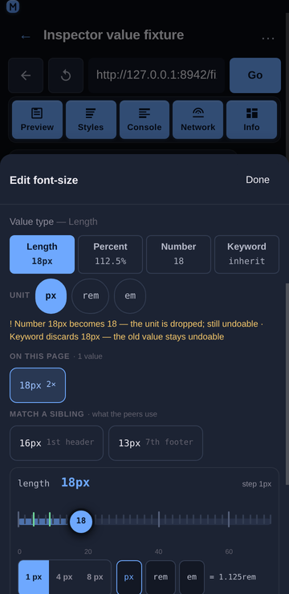

# Inspector value types

## Overview

A CSS declaration's **type** is invisible in the panel: `14px`, `14`, `87.5%`, `0.875rem` and `auto` all read as “the value of padding”, yet they are not interchangeable — some are the same value written differently, some discard information, and some cannot be derived without a base size the inspector may not have. The edit sheet therefore carries an explicit **value type** switch and a **unit** control next to the value field, and both state their cost before they are tapped.

## Usage

Tap any declared style row (or a quick-add chip) in the Styles panel to open the edit sheet, then type or edit the value. Below the **Value** label:

> **A property the element does not declare yet opens on its family's neutral value** — `0px` for a length, `0` for a number, `0ms` for a time, `0deg` for an angle — rather than on an empty field, so the type switch, the unit row and the rail are all there from the first tap. A colour, a keyword and a custom property have no neutral form worth inventing (`#000000` is a choice, not an absence), so those fields stay empty and the page palette or the keyword chips are the input. Nothing is written to the page until **Apply**, and the seeded value is editable like any other.

1. **Value type** — one segment per applicable type with the value it would write underneath:
   - **Length** (`16px`), **Percent** (`100%`), **Number** (`16`), **Keyword** (`inherit`) for a `font-size`;
   - **Colour** and **Keyword** for a colour;
   - **Time** (**ms** / **s**) for a duration, **Angle** (**deg** / **turn** / **rad**) for a rotation.
   The type in force is highlighted and shows the current value. Tapping another type rewrites the field — nothing is written to the page until **Apply**.
2. **Unit** — a chip row for the type in force (`px` / `rem` / `em` for a length, `ms` / `s` for a time, `deg` / `turn` / `rad` for an angle). Same value, different unit: `16px` ⇄ `1rem` with a 16 px root, `180ms` ⇄ `0.18s`, `0.5turn` ⇄ `180deg`. A unit whose base size is unknown is shown ticked-out (`rem` with no root size read yet) rather than computed from an assumed 16 px.
3. **The warning line** — names the cost of the lossy forms: `Number 16px becomes 16 — the unit is dropped; still undoable · Keyword discards 16px — the old value stays undoable`. Forms that cannot be derived are listed with the reason instead of offering a guessed number: `Percent: a percentage of font-size needs a base size the inspector does not read`.
4. **Apply** — commits the value that is in the field. The switch itself never writes, so a type change is one property and one undo entry, and the element's other declarations are untouched.

## Behaviour

- **Which types are offered is per property**, from the property's family plus the suffixes CSS itself uses (`border-top-width` is a length, `transition-delay` is a time, `background-color` is a colour). A property whose value is a keyword set (`display`) gets the keyword form only; an unparsable value (`url(hero.png)`, `calc(100% - 2px)`) gets no invented conversions. The keyword sets are also what the enum view renders, so adding one is how a property gains segments: `transition-timing-function` and `animation-timing-function` are listed with the easing keywords (`ease`, `linear`, `ease-in`, `ease-out`, `ease-in-out`, `step-start`, `step-end`) precisely so those two properties get chips instead of a typed field that would ask for `cubic-bezier(0.4, 0, 0.2, 1)`.
- **`0` is a length, not a number.** `padding: 0` classifies as a length (a zero length needs no unit) while `line-height: 0` stays a number, because that is what the two properties accept. `0px` ⇄ `0` is reported lossless and says “0 needs no unit”.
- **A bare number is not silently a length.** `14` → `14px` keeps the digits but changes the meaning, so it is offered, flagged not-lossless, and the discarded text is named. Undo restores it.
- **Which conversions are lossless** follows CSS, not arithmetic: absolute lengths (`pt`, `pc`, `in`, `cm`, `mm`, `q`) to px, px ⇄ rem/em when the base is known, px ⇄ % for `font-size` (the base is the parent's font size), opacity `1` ⇄ `100%`, times and angles, and colour formats. Decimal noise is rounded to four places, so `1rad` reads `57.2958deg`.
- **A percentage is refused where it means something else.** `padding: 14px → %` needs the containing block's width; `z-index: 3 → 3%` is not a stacking order; `flex-grow: 1 → 100%` is a different value. Each is disabled with its reason rather than converted.
- **Custom properties are typed by what they hold.** `--space-card: 14px` gets the length switch (so a design token is editable as a length), while `var(--w)` used *as* a value is the custom form and gets no numeric switch.
- **The base font sizes are read from the page**, not assumed: root for `rem`, the parent element for `em` and for a font-size percentage. They travel with every pick (`buildNodeModel`) and with every post-edit read (`readElementStyles`), so the switch is fully available the moment an element is selected — an earlier version read them only after an edit, which left `Percent` and `rem` disabled exactly when the user wanted them.
- **The `−` / `+` steppers move by the page's own step.** When the value index finds a numeric scale for the property being edited (`steps of 4px`), a nudge moves by 4 and the line under the field says so (`Stepping by 4px — this page's own scale · nearest 12px`); without a scale the original ±1 behaviour is kept, and a caller that passes its own precision overrides both. See [Inspector value suggestions](./inspector-value-suggestions.md) for the snapping arithmetic.

## Implementation notes

- **Pure model:** [`frontend/src/components/inspector/valueKinds.js`](../../frontend/src/components/inspector/valueKinds.js) exports `classify`, `kindsFor`, `propertyFamily`, `alternatives`, `convert`, `unitOptions`, `keywordsFor`, `formatNumber`, `percentBase`, `KIND_LABEL`, `UNITS` and the keyword sets. No DOM, no CDP: a property name, a value string and a `{ rootFontSize, parentFontSize, fontSize }` context go in; a type, a set of alternatives and a loss report come out.
- **Component:** the `ValueTypes` component in [`frontend/src/components/inspector/StylesPanel.jsx`](../../frontend/src/components/inspector/StylesPanel.jsx) renders the segments, the unit row and the warning line, and only appears when there is more than one form to offer or more than one unit to cycle.
- **No new endpoints and no extra round-trip:** the base sizes ride on the `Runtime.callFunctionOn` reads the panel already makes. The write path is unchanged — `style.setProperty(prop, value)` on the one property, so the type switch cannot touch anything else on the element.
- **Mobile-first:** every segment and unit chip is a ≥44 px target, the value under each label is the value that would be written, and a blocked form is visible-but-disabled (dashed) instead of hidden, so the type is discoverable without being tappable.
- **Tests:** `npm run test:inspector` covers this with `scripts/test-inspector-value-kinds.js` (165 assertions): classification for 23 property/value pairs, the easing keyword sets (the five easing names and the two stepped ones for both timing-function properties, the CSS-wide keywords still last, and no easing offered for a property that does not take it), families and suffix heuristics, the kinds offered per property, lossless conversions (px ⇄ rem/em, px ⇄ % of font-size, ms ⇄ s, deg ⇄ turn ⇄ rad, opacity number ⇄ percent), the refusals (padding px → %, z-index → %, rem with no context), the lossy ones (bare number → px, length → number, anything → keyword) with their discarded text, unit cycling including a missing base, keyword lists, number formatting, custom-property typing, the neutral seed a property with no value starts on (a length as `0px`, a number as `0`, a time as `0ms`, an angle as `0deg`, and nothing invented for a colour, a keyword or a custom property, with the seeded value offering the unit cycle and the type switch), and the wiring that both style readers report the base sizes and the panel hands them to the sheet. `scripts/test-inspector-feature-inventory.js` pins the switch's presence.

## Related

- [Inspector Styles panel](./inspector-styles.md) — tap-to-select, inline editing, matched rules, computed values.
- [Inspector value suggestions](./inspector-value-suggestions.md) — the values and tokens the page already uses for the property being edited.
- [Inspector target bar](./inspector-target-origin.md) — which element and which rule an edit lands on.
