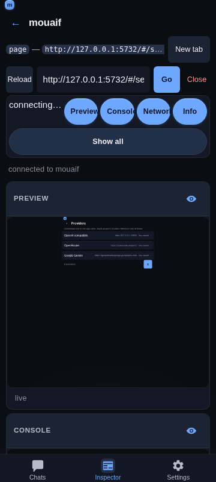

# Inspector — custom DevTools-style mobile UI

## Overview

The **Inspector** tab provides a mobile-first DevTools experience for inspecting and debugging web pages directly from your phone or desktop browser. It connects to any Chrome or Chromium browser instance running with remote debugging enabled.

## Getting started

1. Start your browser with remote debugging enabled (default port: `9222`).
2. Open the **Inspector** tab in mouaif.
3. Verify or enter the debugger URL (`http://127.0.0.1:9222`) and tap **Discover targets**.
4. Select a tab from the list to inspect it.

> **Tip for mobile devices:** To inspect a page on your physical device, forward the port with `adb reverse tcp:9222 tcp:9222` and point the debugger URL to `http://127.0.0.1:9222`.

## Panels

You can toggle each of the four panels on and off to customize your workspace:

### 1. Preview panel
- **Live page preview** — captures full-height snapshots of the active page. For Chrome's built-in PDF viewer, the Inspector automatically switches to a viewport capture so Chrome includes the separately composited PDF pages instead of showing only the empty viewer UI shell.
- **Pick-mode banner** — while the Styles panel has *pick mode* armed, the preview shows a **Pick: tap an element in the page** banner over the screenshot with a **Cancel** button, the tap surface is outlined in the accent colour, and the cursor is a crosshair. The same banner appears in the full-screen overlay. A selection disarms pick mode; a tap that hits nothing selectable keeps it armed. See [Inspector Styles panel](./inspector-styles.md).
- **Fit width / natural size** — a toggle in the preview footer (and in the full-screen header) switches between two zoom modes. **Fit** scales the screenshot to the frame width, so a tall page scrolls vertically — the default for narrow pages. **Natural size (100%)** renders the capture at the page's own CSS size, so a wide page (e.g. the **Laptop** 1280 px preset) shows readable text and pans both axes instead of being squashed to a ~30% thumbnail. The capture is a *device-pixel* image, so the panel divides its width by the preset's `deviceScaleFactor` before painting it: a 2×-retina Phone capture of a 375 CSS px page paints 375 CSS px wide, not 750. That keeps the page's proportions on screen, keeps the screenshot 1:1 with the physical pixels of a matching display instead of a soft 2× upscale, and keeps the panning surface four times smaller. dpr 1 captures are unchanged. The choice persists across reconnects. On the first render the panel auto-selects a sensible default: if a page would fit the frame at ~60% width or more it stays in **Fit**; if it would be shrunk below that (unreadable) it switches to **Natural size** — so a wide page is readable without hunting for the toggle. Switching the mode manually always wins. The auto-fit threshold compares the frame against the page's **CSS** width, not the capture's device-pixel width, so a retina capture (the Phone/Phone+ presets at `deviceScaleFactor: 2`, whose screenshot is 2× the page's CSS width) is measured correctly — a narrow phone page stays in **Fit** instead of being misread as too wide.
- **Interactive tapping** — tap anywhere on the screenshot to click elements or interact with the page remotely. A tap is mapped to the page through the image's own bounding rect, so it stays accurate after you pan the frame (scroll down/right). The frame's scroll offset is not added a second time — `getBoundingClientRect()` already accounts for it — which keeps a pan-then-tap click on the exact element you aimed at, no matter how far you scrolled.
- **Full text input** — tap a text field in the live preview to focus it, then type into the panel's **Type into page** bar (the keyboard icon in the Preview header). The whole string is forwarded to the focused element with CDP `Input.insertText`, which handles spaces, unicode, and emoji in one shot. An adjacent **↵** button sends a real Enter keypress so forms submit and textareas get a newline instead of a literal character. The same bar appears in the full-screen preview overlay so you can keep filling forms while it's open.
- **Scroll & navigation** — scroll through tall pages and follow links in real-time.
- **Viewport size presets** — a dropdown in the Preview panel header applies a CDP device-metrics override to the inspected page: **Auto** (native size), **Phone** (375×667), **Phone+** (414×896), **Tablet** (768×1024), and **Laptop** (1280×800). The page reflows live so media queries and responsive breakpoints respond as if the browser were that size. The phone presets emulate a retina handset (`deviceScaleFactor: 2`) so the capture is sharp on a real phone instead of a soft 1× upscale.
- **Continuous refresh** — while Preview is visible, a low-resolution CDP `Page.startScreencast` supplies event-driven repaint notifications. Each frame is acknowledged after its full-page screenshot, so Chrome applies natural backpressure while animations, typing, hover states, and DOM mutations remain live without a busy polling loop. The pacing window opens when the previous capture *finished* (not when it started), which keeps a slow full-page capture from being followed immediately by another one — at most one capture per ~100 ms of capture time. Lifecycle captures (`Page.frameNavigated` and `Page.frameStoppedLoading`) plus a slow 3 s safety retry cover older targets that do not support screencasting.
- **Unchanged captures are dropped** — a page that did not change between two captures produces a byte-identical PNG. The panel compares each capture with the one already on screen and returns early when they match, so an idle page costs no image decode, no layout, and no scroll write. Without that guard every poll re-assigned the same image, which re-decoded the capture and rewrote the frame's scroll offsets on each tick — visible as the preview hitching while you scrolled it.
- **Capture quality** — previews use lossless PNG at the inspected page's native capture resolution, avoiding JPEG artifacts around small text, colored edges, and fine UI details. The panel, full-screen view, and Draft Craft annotation all use the same lossless image; no setting is needed. The capture already *is* base64 PNG, so it is published straight to the `` as a `data:` URL and decoded natively by the browser; it is never copied through JavaScript (no `atob` byte loop, no intermediate `Blob`/object URL) and no wrapper re-encodes it. Viewport sizing and tap coordinates are unchanged. PNG captures can use more bandwidth on photo-heavy pages, so the single-capture backpressure still limits work on slower connections. The discarded screencast signal stream stays low-resolution JPEG (`quality: 20`, 320×320) because it is only a change detector, not the rendered image.
- **Refresh preview** — a refresh button in the Preview panel header forces a fresh screenshot on tap, independent of automatic capture. During a page reload, the load-complete capture is queued behind any in-progress navigation capture so the newly loaded content replaces Chrome's transient blank frame immediately. Screenshot requests time out after 8 seconds so an unresponsive Chrome target cannot leave the preview stuck on `capturing…`; automatic retries continue afterward.
- **Full-screen preview** — the Preview panel header's full-screen button (an icon in place of the panel label) opens the live preview in a viewport-spanning overlay that renders above the app dock. The overlay header mirrors the Web preview modal: it shows the live page's title (from `document.title` via CDP `Runtime.evaluate`) with a small host subtitle on the left, plus a **Refresh** button (re-captures the screenshot), a **Capture size** dropdown (the same Auto / Phone / Phone+ / Tablet / Laptop presets the panel uses), and a close button on the right. On narrow phones (<430 px) the Refresh button collapses to icon-only, the size dropdown fills the remaining width, and the close button floats to the top-right corner so all controls stay inside their 44 px tap targets. The same capture loop keeps running, so the overlay stays live; tap-to-click and scroll still work, and the overlay closes via its close button or the Escape key.
- **Draft Craft annotation** — draw on the latest preview and add it to a chat draft. The full-screen annotation surface renders above the app dock, including on narrow mobile viewports.

### 2. Console panel
- **Live logs** — see `console.log`, `info`, `warn`, and `error` messages with timestamps and severity indicators.
- **Interactive JavaScript Console** — execute JS expressions directly on the page with autocomplete for globals, properties, and element IDs.
- **Stack traces** — tap any log row to inspect formatted stack traces and object details.

### 3. Network panel
- **Request inspector** — view live HTTP requests and responses, status codes, transferred sizes, and timing metrics.
- **Request headers & payloads** — tap any request to inspect headers and response bodies.
- **Color-coded status** — quick visual indicators for successful, redirected, pending, or failed network calls.

### 4. Info panel
- **Page vitals** — monitor live DOM node counts, JavaScript heap usage, event listeners, frame rates, and layout recalculations.

### Polling and freshness

The Info panel polls `Performance.getMetrics` every 2.5 s and the Preview
panel's device-preset choice (size + DPR) is read at capture time. Both read
the current value through a ref rather than closing over `props`:

- the parent builds a fresh `metrics` callback on every render, so an effect
  that depended on it restarted the poll on each render — including the
  render caused by every console/network row;
- the capture effect is keyed on the capture/subscribe callbacks, so its
  image `onload` would otherwise decide the device scale factor from
  whatever preset was current when the effect last restarted.

### Entry retentionBoth list panels keep the newest **2000** entries and drop the rest. The
cap applies to the backing store, not only to the rendered window: an
evicted entry releases the response body it captured (up to 200 KB) and is
removed from the request-id map, so a long session against a chatty page
(polling app, HMR loop) cannot grow the tab's heap without bound. A CDP
event for an already-evicted request is ignored rather than re-creating the
row. Disconnecting resets the buffers entirely.

## Tab management

Use the top navigation bar to:
- Enter a new URL to navigate the tab.
- **Go back** — the back arrow icon navigates the tab one entry back in its history (CDP `Page.navigateToHistoryEntry`). If there's no previous entry the action is a friendly no-op — the status pill reads "no page to go back to" instead of an error.
- **Reload** the page.
- **Open new tab** in the attached browser.
- **Close tab** when done — opens an in-app confirmation sheet (see below).

Every chrome control is a full-size, touch-first target. The back/reload/Go buttons in the nav row, the panel-head refresh / full-screen / type / eye toggles, the preview-size dropdown, the panel chips, and the Styles panel's header icon buttons (clear, refresh, pick mode) and quick-add chips all use the ≥ 44 × 44 px `--tap` size, so nothing in the inspector relies on a hover-only or sub-44 px tap. The dropdown, popover, and target-row menus also use 44 px rows.

The inspector header icon buttons are glyph-only (the panel-head controls: full screen, Draft Craft, refresh, type into page, hide/show, and the nav-row back/reload). Every button keeps its `aria-label` + `title` for assistive tech, since the tooltips that carry their meaning don't exist on touch. The Styles panel header (clear, refresh, pick/stop) is the exception: it uses the shared `.icon-btn--labeled` variant, which renders a compact label under the glyph — the same icon-over-label pattern as the panel chips — so its actions read on mobile. The Styles labels are sized so the header stays on a **single line** down to the 360 px minimum; the Styles element label ellipsizes instead of wrapping.

### Closing a tab

Close tab is destructive, so the Inspector prompts for confirmation before sending the request to Chrome. Both entry points (the per-row `…` menu in the targets list and the header overflow menu of an attached tab) open the same in-app sheet:

- The sheet shows the tab's title in quotes (or the URL host when the title is empty) so the user can confirm the right target.
- **Cancel** dismisses the sheet with no network call.
- **Close tab** sends `POST /api/inspector/close` with `{ targetId }`. On success the Inspector disconnects the live CDP session, returns to the targets list, and refreshes the target list so the closed tab disappears. Failures surface on the status pill instead of re-opening the sheet.
- Target-row menu actions pass the selected target first and the action name second, matching the shared action handler. This keeps both **Reload** and **Close tab** functional from each row's `…` menu.

The previous design used `window.confirm`, which some embedded web views auto-dismiss and return `false` without rendering a dialog; the close handler then early-returned and the user saw the button as inert (no status pill, no network call). The in-app sheet renders inline so it always renders, always accepts input, and obeys the mobile-first UI rules (≥ 44 × 44 px tap targets, safe-area padding).

## Implementation notes

- The Inspector's styles are the biggest CSS surface in the app, so they are split by panel: `frontend/src/inspector.css` is the entry point that `@import`s twelve parts (`inspector-chrome.css`, `inspector-targets.css`, `inspector-pick-mode.css`, `inspector-panels.css`, `inspector-sheets.css`, `inspector-target-bar.css`, `inspector-value-suggestions.css`, `inspector-value-rail.css`, `inspector-value-kinds.css`, `inspector-intent.css`, `inspector-value-type.css`, `inspector-styles.css`). The order of those imports **is** the cascade — several sections override earlier ones — and Vite inlines them into the same bundle the single file produced.

## Related

- [Chrome Debug MCP](./chrome-debug-mcp.md) — letting the AI assistant automate the browser.
- [Web preview tool](./webpreview.md) — in-chat page preview thumbnails.
