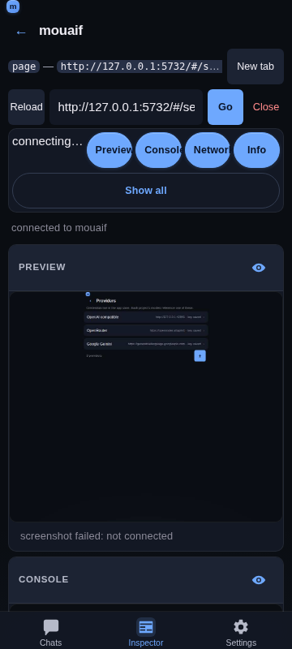
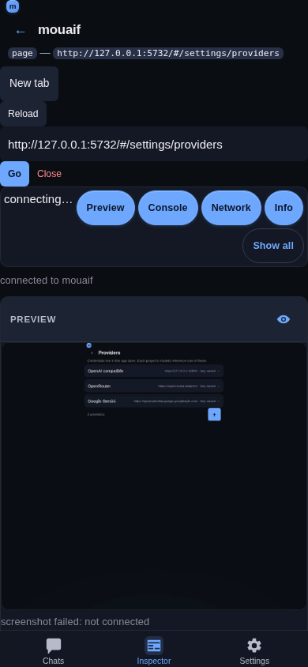
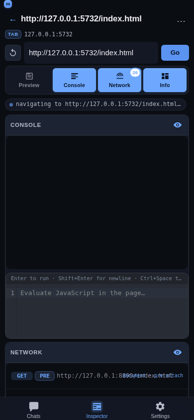

# Inspector — custom DevTools-style mobile UI

## Overview

The **Inspector** tab in the mobile shell ([frontend/src/main.jsx](../../frontend/src/main.jsx) → `InspectorView`) is a from-scratch DevTools-style UI built on top of the **Chrome DevTools Protocol (CDP)**. It is *not* the default Chrome panel embedded in an iframe — the browser speaks CDP directly over WebSocket, the mouaif server ([src/inspector.js](../../src/inspector.js) + [src/index.js](../../src/index.js)) is a thin relay. The UI is mobile-first and ships four **optional panels** — **Preview** (live screenshots of the page), **Console**, **Network**, and **Info** (page metrics) — that the user toggles on and off individually. All toggled-on panels are stacked vertically and share the available height; toggled-off panels are unmounted so their capture loops and virtual lists stop running. The default for a first-time visit is "all four on"; the user's choice is remembered in `localStorage` so it survives a reload and a new target. The UI and CDP client are loaded as a separate JavaScript chunk only when the Inspector route is opened, keeping them out of the app's initial bundle.








The Inspector is the last piece of the spec from [decisions.md §6](../decisions.md) and §9 build-order item 14: a from-scratch mobile-friendly UI that consumes CDP events but never embeds the Chrome panel.

## Architecture

```
+--------------------+        +--------------------+        +--------------------+
|  mobile UI         |  WS    |  mouaif server     |  WS    |  Chrome (debug)   |
|  (Preact + Vite)   | <----> |  /api/inspector/   | <----> |  --remote-         |
|  InspectorView     |        |  proxy relay       |        |   debugging-port  |
+--------------------+        +--------------------+        +--------------------+
```

- **REST surface** — `GET /api/inspector/config`, `PUT /api/inspector/config`, `GET /api/inspector/version`, `GET /api/inspector/targets`, `POST /api/inspector/open`, `POST /api/inspector/close`, `POST /api/inspector/reload`, `POST /api/inspector/navigate`. The mobile UI calls these over plain `fetch()`.
- **WebSocket proxy** — `WS /api/inspector/proxy?host=<httpBase>&targetId=<id>`. The browser opens this URL; the server resolves the target id against the Chrome `/json/list` payload, opens a second WebSocket upstream to `webSocketDebuggerUrl`, and pipes frames in both directions until either side closes.
- **Per-connection, no shared state.** The proxy is a per-connection relay; the server does not parse, buffer, or transform CDP frames. That keeps the surface tiny and means future CDP domains are free.

The proxy is the only path for browser → Chrome traffic. There is no fall-back to an HTTP polling mode — the whole point of DevTools is the live stream.

## Configuration

The browser has to know where the debug Chrome instance is. That location is the **HTTP base** of the Chrome instance, e.g. `http://127.0.0.1:9222`. Chrome exposes `/json/version` and `/json/list` over plain HTTP on that base; the server reads them to discover targets and to resolve a `targetId` to its `webSocketDebuggerUrl`.

The configured URL is stored in the app SQLite store under the key `inspectorDebuggerUrl` ([src/inspector.js](../../src/inspector.js) → `APP_KEY_DEBUGGER_HOST`). The setup phase of the Inspector tab shows the current value plus the built-in default (`http://127.0.0.1:9222`). `Save & discover` persists the value and immediately fetches the target list. `Discover only` re-uses the current value.

The environment variable `MOUAIF_CHROME_URL` overrides the default for headless / test environments. An empty value in the app store falls back to the default.

### Phone tip

On a physical device, Chrome runs on the phone and `mouaif` runs on a laptop. Forward the port with `adb reverse tcp:9222 tcp:9222` and point the URL at `http://127.0.0.1:9222`. On the same network you can also use the phone's LAN IP.

## UI flow
The view is a 3-state machine. The phase, saved debugger URL, and
current target live in Preact `useState`; the high-frequency CDP
buffers (console / network entries, request map, virtual-list
handles) live in `useRef` so a CDP message burst does not thrash
the tree.

1. **Setup** — input the Chrome debugger URL, save, and discover.
   Shown only when the app has no saved URL yet.
2. **Targets** — list of discoverable pages / iframes / service
   workers / background pages, with a type chip, a title, a host
   subtitle, and a per-row overflow menu (Connect / Reload / Close).
3. **Inspect** — connected to a specific target, with the four
   optional panels (Preview / Console / Network / Info) shown
   stacked when toggled on. The header shows the target's title,
   type, and URL. A status line above the panel stack reports
   the current WebSocket state.

The view skips straight to **Targets** on mount when a saved URL is
present: `loadConfig` triggers `loadTargets` via `setTimeout(0)` so
the targets phase's status element is mounted before the request
fires. Returning users no longer have to retap **Discover** every
visit. The setup screen still shows when no URL is saved. Each phase
has a per-screen back button that walks the state machine backwards
and tears down any open WebSocket.

The **Targets** screen also has a **Page URL** field for one-step
inspect: type a page URL (e.g. `http://localhost:3000`, or bare
`localhost:3000` — the scheme is added for you), tap **Open &
inspect** (or press Enter), and the server tells Chrome to open that
page in a **new tab**, then attaches the inspector straight to it.
No need to open the tab yourself or pick from the target list. The
manual list below remains available for tabs that are already open.

While inspecting a target, the header shows the page's URL in a code
chip plus a **New tab** button (`POST /api/inspector/open`, the same
endpoint behind **Open & inspect**). Tapping the button opens that
same URL in a fresh Chrome tab; the outcome is reported on the status
line. The button is a 44 px+ touch target (the previous URL-as-link
affordance was ambiguous and hard to tap), and the current connection
keeps its target — no re-attachment.

## Optional panels

The Inspect view does not switch between sub-tabs. Instead, each
of the four panels is **optional**: the user picks which ones are
visible, and the visible panels are stacked vertically. The
intent is to let a mobile-first user focus on the one or two
signals they care about (e.g. the live preview while iterating
on a layout, or the network panel while debugging an API call)
without paying the cost — both screen real estate and CPU — of
the panels they have toggled off.

### The panel toolbar

A single row of icon chips sits between the nav row and the panel
stack. One chip per panel, each a 36 x 36 px square with an inline
SVG glyph:
- **Preview** (frame icon) — live page screenshots
- **Console** (log-line icon) — `Runtime.consoleAPICalled` / `Runtime.exceptionThrown`
- **Network** (network-graph icon) — `Network.requestWillBeSent` / response / finished
- **Info** (4-quadrant icon) — page metrics (`Performance.getMetrics`)
Each chip has two states: **on** (filled with the accent colour,
matching the rest of the active-control language in the app) and
**off** (outlined, muted). Tapping a chip toggles the matching
panel. The chip's text label lives in the tooltip + aria-label so
screen readers and mouse hover still get the full name; on screen
only the glyph shows, the iOS DevTools-style segmented-control
pattern.

The chips are equal-width (`flex: 1 1 0`) and never wrap, so the
toolbar fits on one line at 360 px wide without pushing any panel
content off-screen. The **Show all** reset lives in the
InspectActionsMenu overflow (see [Inspect header](#inspect-header))
instead of as a 5th chip on this row.

### Per-panel card### Per-panel card

Every panel — visible or not — is wrapped in a `PanelCard` that
draws a small header strip (panel label + an eye toggle) and a
body. The body is `null` while the panel is hidden, so the
underlying panel component (and the virtual list, capture loop,
or metrics poller it owns) **unmounts**. Hiding a panel really
does stop its work, not just hide its DOM.

The eye toggle in each card's header is a shortcut for the
toolbar chip and is always reachable. The eye glyph shows the
panel's current state: an open eye when visible, an eye-with-a-
slash when hidden. Tapping the eye flips the state.

### State and persistence

The set of visible panel IDs lives in Preact `useState` in
`InspectorView` and is hydrated from `localStorage` under the key
`mouaif:inspector:panels` (a JSON array of panel ids). The
default for a first-time visit is "all four visible". The state
is **global across targets** — picking panels on one target
keeps the same panels visible when the user switches to another
target. The list is filtered against the canonical `PANELS`
allowlist on every load, so a hand-edited localStorage value
that names a non-existent panel is silently dropped.

The last-visible-panel guard prevents the user from hiding every
panel. If the user tries to toggle off the only remaining
visible panel, the toggle is a no-op (and the toolbar's
**Show all** chip is the recovery path). The same fallback runs
on mount: an empty saved set resets to the default.

The sub-components that render the panels (`PanelCard`), the
target list (`TargetRow`, `TargetMenu`), and the inspect-view
overflow (`InspectActionsMenu`) are defined at **module scope**,
not inside `InspectorView`'s render function. Defining them
inside the render gave every render a brand-new component type,
so Preact unmounted and remounted the whole subtree on every
state change — toggling a panel chip would tear down the preview
capture loop and reset the live preview, and a CDP-triggered
`rerender()` would drop the open menu state. Hoisting them keeps
the preview ``, the virtual lists, and the menu open-state
alive across re-renders; the parent passes data and actions in as
props instead of them closing over the parent render.

### Sizing
The visible panels are flex children of a vertical stack. The
layout has two regimes, picked by viewport width:

- **Mobile (default, < 900 px)** — each panel has its own
  intrinsic height. The **Preview** panel is `40 dvh` tall
  with a `220 px` floor so the screenshot is legible above
  the fold. The Console and Network virtual-list scrollers
  are `32 dvh` tall with an `180 px` floor so a panel of
  log entries or requests is scannable in one screen. The
  Info metrics card is content-sized. The page scrolls if
  the four panels do not fit; the user reaches Console,
  Network, and Info by scrolling the page, and inside each
  list by scrolling the scroller. This is the right model
  on a phone because the four panels' intrinsic heights
  already exceed the viewport — having the first panel
  "grow" on a phone would just compress the other three to
  a sliver.
- **Wide screen (>= 900 px)** — the first visible panel
  gets a `grow` modifier and takes the remaining viewport
  height; the other visible panels keep their intrinsic
  heights. Hiding a panel gives the remaining panels more
  room without any user action: the _preview_ takes the
  full leftover height if the user kept only the preview;
  the _console_ becomes the full scroll container if the
  user kept only the console; etc. The grow has a
  `240 px` min-height so the panel never collapses to
  nothing. This is the right model on a tablet or desktop
  where the four panels do fit above the fold and the
  user benefits from the first panel "claiming" the
  leftover height (e.g. a tall screenshot filling the
  page while Console / Network / Info share the rest).

The breakpoint is intentionally high: at 600-899 px (small
tablet, phablet) the available height is still tight enough
that the "first grows" behaviour would just compress the
non-grow panels. Below 900 px the layout stays predictable
— the user always sees the same panel heights regardless
of which panels are visible — and the page scrolls.


### Empty state

If somehow every panel ends up hidden (e.g. by removing the
localStorage key on a device that previously had a saved state
and then saving a fresh empty set programmatically), the panel
stack is replaced by a small dashed card with the text "No
panels visible." and a one-tap **Show all panels** button that
restores the default. In normal use the per-panel guard makes
this state unreachable from the UI, but the empty card is the
recovery affordance when it is reached.

## Tab management
The Inspector can **reload**, **navigate**, and **close** tabs of the
debug Chrome — both from the targets list and, for the page being
inspected, from the inspect header. The server talks CDP directly to
Chrome (`Page.reload` / `Page.navigate` on the target's WebSocket,
`Target.closeTarget` on the browser-level WebSocket), so these
actions work without an active inspector connection.

### Targets list rows
Each row is a tappable card with a **type chip** on the left, the
title above the host subtitle on the right, and a `…` overflow on
the far right. Tapping the body of the card is the primary action
(**Connect**). The overflow menu holds the per-row actions:

- **Connect** — same as tapping the body.
- **Reload** — visible only for targets of `type === "page"`
  (iframes, service workers and background pages do not have a
  reload action in CDP).
- **Close tab** — visible only for `type === "page"` targets; the
  server-side `Target.closeTarget` is called and the list is
  refreshed so the closed tab disappears.

The chip color follows the type: **TAB** / **FRAME** (accent blue)
for pages and iframes, **SW** / **WORKER** / **SHARED** (amber) for
workers, **BG** / **OTHER** (muted) for everything else. The chip
makes it easy to tell at a glance which row is a service worker vs
a normal tab.

The list itself is rendered declaratively as Preact children (the
previous version mutated a shared `<ul>` via `setTimeout` +
`createElement`, which raced Preact reconciliation and made refresh
actions flaky on a busy target list). The empty state shows a short
"how to" hint and a centred **Refresh targets** action instead of a
bare `<li>`.

### Inspect header

While inspecting, the chrome above the panel stack is four strips on every viewport, designed mobile-first so the first panel sits comfortably above the fold on a 360 x 800 phone:

- **`.view-head` (38 px)** — the back arrow, the page title (ellipsised on narrow viewports), and the **`...` overflow menu** on the right. The overflow holds the less-frequent chrome actions (Reload, Open in new tab, Show all panels, Close tab) so the always-visible URL row below carries only what the user does every few seconds.
- **`.inspector__sub` (24 px)** — a single-line subtitle with the target type chip (TAB / FRAME / SW / BG / OTHER) on the left and the host URL on the right (ellipsised on narrow viewports). Replaces the old standalone `.inspector__head` row (50 px tall) that repeated the URL chip a second time.
- **`.inspector__nav` (50 px)** — an icon-only **Reload** glyph button on the left, the URL input in the middle (flex-grows), and the primary **Go** button on the right. The previous layout put the text Reload / URL / Go / Close buttons on this row, which made the URL field narrow on a 360 px phone and pushed Close off the edge; Close moved into the overflow menu.
- **`.inspector__panelbar` (46 px)** — the four panel chips. The chips are now icon-only (inline SVG) and equal-width across a single 46 px row, so the panelbar fits on one line at 360 px wide. The `Show all` reset lives in the overflow menu instead of as a 5th chip.

The chrome above the first panel went from 282 px on a 360 px viewport to 197 px (-30 %), and the first panel now starts at 217 px instead of 301 px, freeing 84 px of usable space above the fold.

The overflow menu (`...` button on the right of the title row) is the same pattern as the targets list's per-row menu and the project-card options menu: a button + a popover with the actions, with the destructive action separated by a hairline above. Tap-anywhere-on-the-page closes it. The popover sits above the panelbar with the same surface-3 background and shadow tokens used by the targets and project menus.

The actions in the overflow menu:

- **Reload** — reloads the attached page (`POST /api/inspector/reload`). The connection survives; the preview, console, and network panels keep streaming.
- **Open in new tab** — opens the attached page's URL in a fresh Chrome tab (`POST /api/inspector/open`). The current connection keeps its target — no re-attachment.
- **Show all panels** — resets the visible-panel set to the default (all four on). The same action the empty-state card offers.
- **Close tab** — closes the attached tab (`POST /api/inspector/close`), after a confirmation. The inspector disconnects, walks back to the targets list, and refreshes it. Rendered in the danger colour and separated from the other items by a hairline so it doesn't sit next to a benign action by accident.

The URL field below the title is pre-filled with the current page URL and submits on Enter. Bare hosts like `localhost:3000` get `http://` added automatically, matching the "Open & inspect" flow.

## Preview panel

When its toolbar chip is on (see [Optional panels](#optional-panels)), the Preview panel shows what the attached page actually looks like, live. It captures the page via `Page.captureScreenshot` (JPEG, quality 55) and paints the result into an `` via an object URL. The capture loop is **event-driven** rather than a fixed timer: the panel subscribes to `Page.frameNavigated` and `Page.frameStoppedLoading` over the same CDP connection, and each of those events triggers an immediate capture. A slow 3 s fallback poll covers in-page state changes that no CDP event fires for (scroll, hover, JS-driven DOM mutations, SPA route changes that don't navigate the frame). The poll resets its 3 s clock every time an event-driven capture lands, so the panel does **not** busy-poll during a navigation burst — an idle page costs at most one capture per 3 s, and a page that just finished loading captures immediately and goes quiet. The loop is strictly sequential (no overlapping captures) and stops as soon as the user hides the Preview chip or disconnects (the `useEffect` cleanup tears down the loop and unsubscribes from the CDP events). `Page.enable` is sent on connection; if the domain is unavailable the panel shows a status line and the other panels keep working.

The screenshot is a **full-page capture** (`captureBeyondViewport: true`), so the shot is as tall as the page's scrollable content rather than just the visible viewport. The frame that hosts the image is a scroll container (`overflow: auto`, `56dvh` tall). The image is scaled to the frame's width (`width: 100%`, height from aspect ratio) and the frame scrolls vertically through the full-page height — a mobile-first "scroll through the page" view. Scaling to the frame width (rather than showing natural device pixels) is required because high-DPR captures come back 2–3× wider than the CSS viewport; at natural size the user would only see a zoomed-in corner of the page. If the user is scrolled inside the frame when a fresh screenshot arrives, their position is restored on image load instead of snapping to the top.

Because the preview is a raw compositor screenshot, the captured page is rendered with the **emulated color-scheme preference**, not the devtools UI's. On connection the inspector sends `Emulation.setEmulatedMedia` with `prefers-color-scheme: light` (the CDP default; older Chrome requires an explicit override — the empty `Emulation.setEmulatedMedia` that used to be sent left the emulated preference as `no-preference`, which dark-mode pages could resolve to their dark stylesheet). Without this, a page that requested light mode but got captured by the dark UI came out as a dark JPEG that no CSS filter could repair. If the target doesn't support the Emulation domain the override is a no-op and the other tabs keep working.

Tapping or clicking anywhere on the preview **forwards a click to the page**. The tap coordinates go through a three-step mapping so the click lands exactly where the user tapped:

1. **Frame → image** — the preview frame is a scroll container, so the tap's client coordinates are first shifted by the frame's `scrollLeft`/`scrollTop` (this matters for pages wider than the frame, where the user panned horizontally before tapping).
2. **Image CSS → natural pixels** — the image is scaled to the frame width, so the frame-relative CSS coordinates are scaled by `naturalWidth`/`naturalHeight` to produce device-pixel coordinates within the full-page screenshot (`captureBeyondViewport` returns device pixels).
3. **Full-page device pixels → viewport CSS pixels** — `Input.dispatchMouseEvent` wants coordinates relative to the live viewport, so `clickAt` (in `inspector/events.js`) first divides by the page's `devicePixelRatio` (queried via `Runtime.evaluate`) to get page CSS coordinates, then subtracts the page's `scrollX`/`scrollY`. If the tapped point is outside the live viewport (e.g. below the fold), the page is first scrolled to bring it roughly centered into view (`window.scrollTo`), then the click is dispatched at the corrected viewport coordinates.

The click is sent as `Input.dispatchMouseEvent` (`mousePressed` + `mouseReleased`, left button) over the same CDP connection. The preview behaves like a remote tap surface, not just a picture — a tap below the fold scrolls the real page and clicks the element the user aimed at.

### Preview refresh + click reliability

The capture loop swaps the screenshot into a single, persistent `` node by reassigning its `src` to a fresh object URL on every capture. The previous version called `setImgSrc(next)` to push a new URL into state, which caused Preact to **unmount the old `` and mount a brand-new one** every 1.2 s. Two side effects followed:

- The user saw a brief blank / "loading" flash on every refresh — the visible "load message" that re-appeared constantly.
- A click landing during the decode window found `imgRef.current.naturalWidth === 0` and silently returned, so the tap on the preview was a no-op until the next refresh.

Reusing the same node removes both. The capture loop also:

- **Is event-driven, not timer-driven.** Subscribes to `Page.frameNavigated` and `Page.frameStoppedLoading` over the same CDP connection; each event triggers an immediate capture. A 3 s fallback poll covers in-page state changes that no CDP event fires for (scroll, hover, JS-driven DOM mutations, SPA route changes that don't navigate the frame). The poll resets its 3 s clock every time an event-driven capture lands, so an idle page costs at most one capture per 3 s.
- Defers `URL.revokeObjectURL` of the previous object URL until the new image's `onload` fires. Revoking too early used to abort the in-flight decode and show a blank frame.
- Caches the last successfully decoded `naturalWidth`/`naturalHeight` in a ref (`lastDims`). `onPreviewClick` uses these as a fallback when the live image is still mid-decode — the page's intrinsic size is essentially constant between captures, so the previous frame is a safe approximation and a click during a refresh still maps to a sensible point on the page.
- Updates the status note from `capturing…` to `live` only on the first successful capture, and only changes it again on error. The per-tick timestamp that used to re-fire through the `aria-live` region on every refresh was just noise.
- Treats a capture that resolves with **no image data** or is dispatched during initial WebSocket connection establishment as transient skips / retries, avoiding transient "not connected" or "screenshot failed" error banners during connection setup.
- Updates navigation state, target title, and address bar value when `Page.frameNavigated` and `Page.navigatedWithinDocument` fire on the inspected target, ensuring live in-page navigation (via preview tap or links) reflects across the inspector chrome.

The `` is mounted with `src=""` (and `draggable="false"`) so the element is in the tree and has a measurable bounding rect even before the first capture lands. Clicks arriving before any capture at all fall back to the rendered rect's own dimensions, so the page still receives a click near the tapped area.

## Console panel

When its toolbar chip is on, the Console panel subscribes to `Runtime.consoleAPICalled` and `Runtime.exceptionThrown`. Each event is rendered as a row with a timestamp, a level chip (LOG / DEBUG / INFO / WARNING / ERROR — colored to match Chrome's own severity), the formatted message text, and a source link (`file:line`) when a stack trace is attached. Object arguments render as compact inline previews (`{a: 1, b: 2, …}`) built from the CDP `preview` payload rather than a bare `Object` description.

Tapping a row opens a **detail sheet**: the full message, the source location, and the complete stack trace for exceptions and traced logs.

The panel keeps the last **2,000** entries in memory and renders them through a [Virtual list](virtual-list.md) with a fixed 64 px row height and an overscan of 6. The new bottom is auto-scrolled into view when an event arrives.

`Runtime.enable` is sent on connection. If the call rejects, the failure shows in the status line and the rest of the view keeps working (we don't tear down on a single failed command).

### JavaScript console
Below the log scroller, the Console panel also ships an editable **JavaScript console** (`JsConsole`) — a CodeMirror editor that evaluates expressions in the inspected page over the same CDP connection. Press **Enter** to run the current expression; **Shift+Enter** inserts a newline; **Ctrl+Space** forces the autocomplete menu. The input clears after a successful run, matching the DevTools REPL, and the result is appended to the same console log as a new row (value types are serialized with `returnByValue`; objects/functions render their RemoteObject preview; exceptions render as error rows with a stack trace).
The console evaluates with `Runtime.evaluate` and `includeCommandLineAPI: true`, so `$0`, `$`, `$$`, `$x`, `inspect`, `copy`, `clear`, and the other Chrome command-line helpers behave like the real console.
**Autosuggestion** layers three sources, all returned as CodeMirror `Completion` objects with `detail` and `type` so the picker reads like DevTools rather than a bare word list:
1. **Live page globals** — a one-shot `Object.getOwnPropertyNames(globalThis)` snapshot of the page's global property names (evaluated via CDP `Runtime.evaluate`), fetched once and filtered by the typed prefix (case-insensitive).
2. **Property completion** — after typing `obj.`, the console asks the page for `Object.getOwnPropertyNames(Object(obj))` on demand, so `document.` suggests `document.body`, `document.querySelector`, etc. in real time.
3. **Element references** — a capped `document.querySelectorAll('[id]')` scan surfaces element IDs (and common element globals like `head` / `body`) by name, with `#id` shown as the completion detail. This snapshot is cached for 2 s so it stays fresh without a CDP round-trip per keystroke.
A curated static table of browser APIs (`window`, `document`, `fetch`, `localStorage`, `getComputedStyle`, …), console helpers, and JS keywords/literals rounds out the list so the menu is populated even before the page answers.
The CodeMirror autocomplete picker is styled to match the inspector's dark surfaces (`mouaif-console-autocomplete`) with 44 px touch rows, monospace labels, and type icons. The editor chunk is shared with the File editor's CodeMirror bundle, so the autocomplete extensions cost no extra network fetch beyond the existing `codemirror` chunk.

## Network panel

When its toolbar chip is on, the Network panel subscribes to `Network.requestWillBeSent`, `Network.responseReceived`, `Network.loadingFinished`, and `Network.loadingFailed`. Entries are keyed by `requestId` so the four events per request collapse into a single row. The row carries the method, the HTTP status (or `···` for pending, `FAIL` for `loadingFailed`), the URL, and a metadata line with resource type, MIME type, transferred size, duration, and remote IP. Status chips are colored by class: 2xx green, 3xx amber, 4xx/5xx red, pending muted, failed red.

Chrome does not replay requests that finished before the Network domain was enabled — `Network.enable` on an already-loaded page emits nothing, and there is no request-history API. So on attach the panel **backfills the page's existing resources** via `Page.getResourceTree` (the main document, subframe documents, and their resource URLs), tagged with a `PRE` status chip and a `pre-attach` meta tag. This keeps an attach to an already-open tab (the common case) from showing an empty log. Backfilled rows are reconstructed entries, not full request records: Chrome retains no size or body for them, so the detail sheet explains that and hides the "Fetch body" button (the sheet's body area shows `(pre-attach — body not captured by Chrome)`). New traffic after attach streams in normally with full detail; the backfill is inserted before any live entries so the timeline stays chronological. The status line reports how many resources were backfilled. If the Page domain is unavailable the backfill is skipped and the panel starts empty.

Tapping a row opens a **detail sheet** with the full URL, timing, remote address, protocol, cache flag, request and response headers, and the response body. The body is fetched lazily via `Network.getResponseBody` on demand (capped at 200 kB in the UI) so the panel doesn't pay for payloads the user never looks at.

The panel renders the last **2,000** requests through the same Virtual list primitive with a 52 px row height. There is no auto-scroll on the Network panel — the user keeps their place while events arrive, matching the Chrome panel.

## Info panel

When its toolbar chip is on, the Info panel shows live page vitals from `Performance.getMetrics`: open documents, frames, DOM node count, JS event listeners, JS heap usage, layout count, and style-recalc count, plus the number of network requests seen in the session. It polls every 2.5 s while the tab is active and renders the counters as a responsive metric grid (2 columns on a phone, 4 on wider screens).

`Network.enable` is sent on connection.
