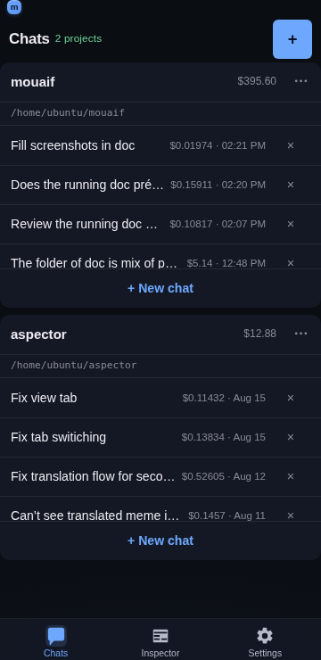

# Project card

## Overview

The Project card is the main organizational view in mouaif: each registered project appears as a card displaying the project name, path, list of chats, a "+ New chat" button, and a project options menu.



## Card features

- **Project header** — displays the project name and path, with an options menu (`⋯`) offering:
  - **Settings…** — opens the dedicated project settings page.
  - **Rename…** — updates the display name of the project.
  - **Unregister** — removes the project from mouaif without deleting any files on disk.
- **Scrollable chat list** — lists previous conversations sorted by most recently active. Each chat row displays:
  - The conversation title.
  - Total token cost and timestamp.
  - A quick delete (`×`) action.
- **+ New chat button** — creates a fresh conversation and navigates directly into it.

## Behavior

- **Independent scrolling** — each card's chat list scrolls internally to prevent tall chat lists from pushing the rest of your dashboard out of view.
- **Responsive height** — the per-card chat list's `max-height` scales with the dynamic viewport (`min(28dvh, 22rem)`) so taller phones get more chats visible before scrolling internally, with an `8.5rem` floor so very short viewports still show a few rows. A legacy fixed `161px` cap was replaced with these responsive units.
- **Recency sorting** — recently opened conversations stay pinned to the top of the card.
- **Cost tracking** — running costs are aggregated per chat and shown directly in the list.

## Implementation notes

The chat list is a `<ul class="project-card__chats">` whose `max-height` is computed in CSS — no JS measurement is needed. The card itself is already a flex column, so the `<ul>` sits at the bottom of the card and scrolls inside its own box.

```css
.project-card__chats {
  max-height: min(28dvh, 22rem);
  min-height: 8.5rem;
  overflow-y: auto;
}
```

## Related

- [Folder picker](./folder-picker.md) — registering new project directories.
- [App and project settings](./app-and-project-settings.md) — configuring project-specific prompts and tools.
- [Chat UI](./chat-ui.md) — the chat conversation view.